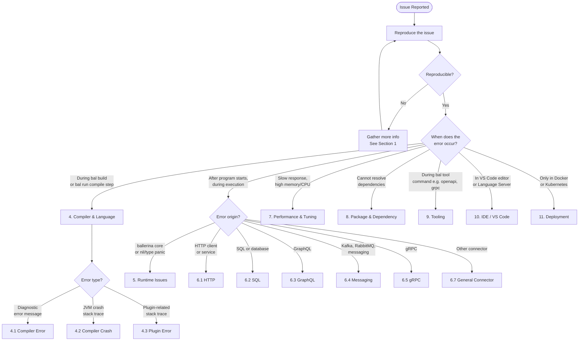
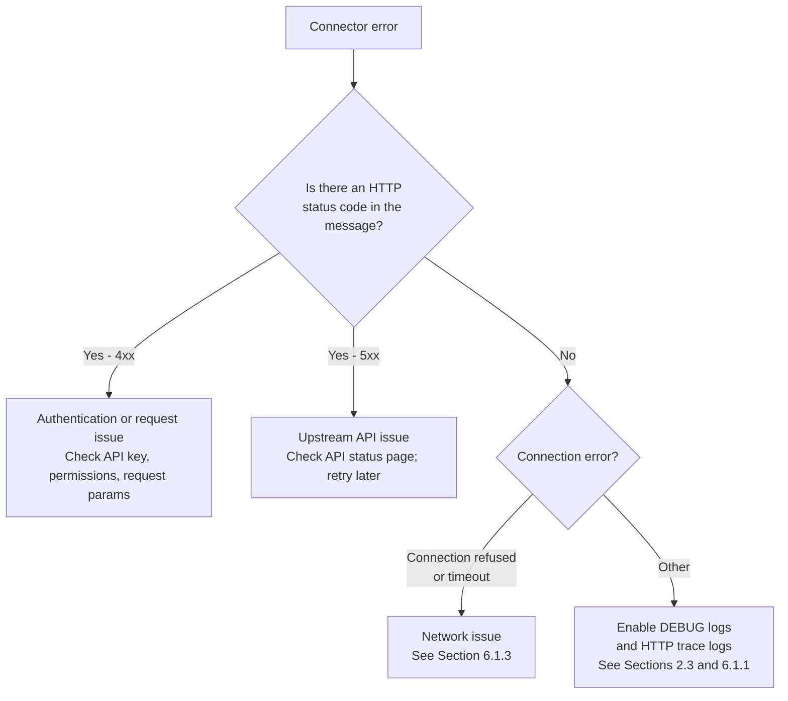
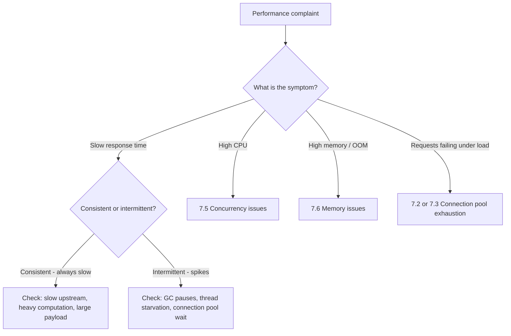
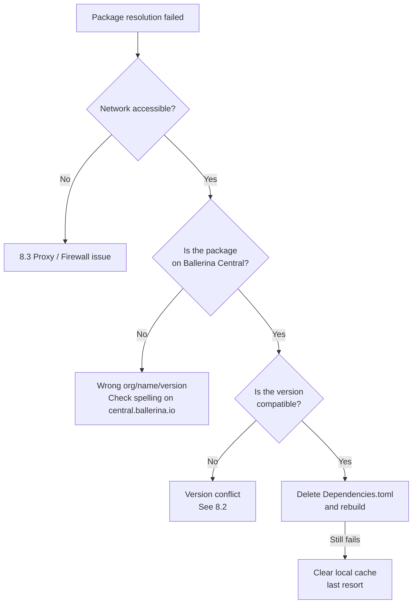
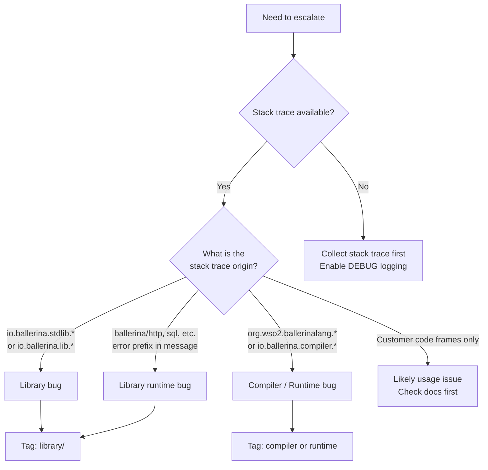

<!-- SOURCE: wso2-enterprise/wso2-integration-internal:docs/ballerina-troubleshooting-guide.md -->
<!-- SHA: d47a5eb0dc08c5aafb46e2cd5f84516b5520414f -->
<!-- Last synced: 2026-04-16 -->

# Ballerina Troubleshooting Guide

|                |                                                    |
| :------------- | :------------------------------------------------- |
| **Date**       | March 2026                                         |
| **Version**    | 0.1.0                                              |
| **Applies To** | Ballerina Swan Lake 2201.4.0 and later             |
| **Author(s)**  | [@ThisaruGuruge](https://github.com/ThisaruGuruge) |

> **Version note:** Code samples, error hierarchies, and default values in this guide are based on the Ballerina version listed above. They may vary slightly across versions — when in doubt, verify against the specific version the customer is running.

---

## Introduction

This guide helps the developers to troubleshoot Ballerina issues and complete a first response. The goal is to define a repeatable process rather than case-by-case samples — though examples are used throughout. The guide is structured to help you:

1. **Collect** the right diagnostic information upfront
2. **Reproduce** the issue locally in a controlled environment
3. **Categorize** the issue correctly
4. **Resolve** it from the customer side when possible
5. **Escalate** with a well-formed report when a product fix is needed

**Assumed knowledge:** You are comfortable reading stack traces, running CLI commands, and editing configuration files. Ballerina runs on the JVM, so standard JVM debugging tools and instincts apply directly.

> **[Internal]** When escalating a customer issue, always use the `wso2-integration-internal` repository. Do **not** use the public `ballerina-platform` repositories directly for customer issues. See [Section 12 — Escalation Process](#12-escalation-process) for details.

---

## Table of Contents

[Quick Fixes Cheat Sheet](#quick-fixes-cheat-sheet)

**Setup**

1. [First Response: What to Collect](#1-first-response-what-to-collect)
   - [1.1 Mandatory Information](#11-mandatory-information)
   - [1.2 Strongly Recommended](#12-strongly-recommended)
   - [1.3 Top 5 Configuration Mistakes](#13-top-5-configuration-mistakes)
2. [Setting Up a Reproduction Environment](#2-setting-up-a-reproduction-environment)
   - [2.1 Matching the Ballerina Version](#21-matching-the-ballerina-version)
   - [2.2 Matching Library Versions](#22-matching-library-versions)
   - [2.3 Enabling Debug Logging](#23-enabling-debug-logging)
   - [2.4 Handling Network and Proxy Issues](#24-handling-network-and-proxy-issues)
3. [Triage Overview](#3-triage-overview)
   - [3.1 Issue Category Decision Tree](#31-issue-category-decision-tree)
   - [3.2 Category Quick Reference](#32-category-quick-reference)

**Compiler and Language**

4. [Compiler and Language Issues](#4-compiler-and-language-issues)
   - [4.1 Compiler Errors](#41-compiler-errors)
   - [4.2 Compiler Crashes](#42-compiler-crashes)
   - [4.3 Compiler Plugin Errors](#43-compiler-plugin-errors)
   - [4.4 Java-Level Errors During Compilation](#44-java-level-errors-during-compilation)

**Runtime**

5. [Runtime Issues](#5-runtime-issues)
   - [5.1 Understanding Ballerina Errors and Panics](#51-understanding-ballerina-errors-and-panics)
     - [5.1.1 Errors vs. Panics](#511-errors-vs-panics)
     - [5.1.2 Reading Error Messages and Stack Traces](#512-reading-error-messages-and-stack-traces)
   - [5.2 Ballerina Core Runtime Errors](#52-ballerina-core-runtime-errors)
   - [5.3 Strand Dump Tool](#53-strand-dump-tool)

**Libraries, Connectors, and Security**

6. [Library and Connector Issues](#6-library-and-connector-issues)
   - [6.1 HTTP Issues](#61-http-issues)
     - [6.1.1 Enabling HTTP Trace Logs](#611-enabling-http-trace-logs)
     - [6.1.2 Enabling HTTP Access Logs](#612-enabling-http-access-logs)
     - [6.1.3 HTTP Client Errors](#613-http-client-errors)
     - [6.1.4 HTTP Listener / Service Errors](#614-http-listener--service-errors)
     - [6.1.5 HTTP Configuration Reference](#615-http-configuration-reference)
   - [6.2 SQL / Database Issues](#62-sql--database-issues)
     - [6.2.1 Connection Issues](#621-connection-issues)
     - [6.2.2 Query Errors](#622-query-errors)
     - [6.2.3 Transaction Issues](#623-transaction-issues)
   - [6.3 GraphQL Issues](#63-graphql-issues)
     - [6.3.1 Error Types](#631-error-types)
     - [6.3.2 Service-Side: Resolver Errors](#632-service-side-resolver-errors)
     - [6.3.3 Common GraphQL Issues](#633-common-graphql-issues)
     - [6.3.4 Compiler Plugin Validations](#634-compiler-plugin-validations)
   - [6.4 Messaging Connector Issues](#64-messaging-connector-issues)
     - [6.4.1 Kafka](#641-kafka)
     - [6.4.2 RabbitMQ](#642-rabbitmq)
     - [6.4.3 NATS](#643-nats)
     - [6.4.4 JMS](#644-jms)
   - [6.5 gRPC Issues](#65-grpc-issues)
   - [6.6 WebSocket Issues](#66-websocket-issues)
   - [6.7 General Connector Error Patterns](#67-general-connector-error-patterns)
   - [6.8 Data Binding Issues (jsondata / xmldata)](#68-data-binding-issues-jsondata--xmldata)
   - [6.9 Security and Authentication Issues](#69-security-and-authentication-issues)
     - [6.9.1 TLS/SSL and Certificate Issues](#691-tlsssl-and-certificate-issues)
     - [6.9.2 OAuth2 / JWT / Token Issues](#692-oauth2--jwt--token-issues)

**Performance and Observability**

7. [Performance and Tuning](#7-performance-and-tuning)
   - [7.1 Identifying the Type of Performance Issue](#71-identifying-the-type-of-performance-issue)
   - [7.2 HTTP Connection Pool Tuning](#72-http-connection-pool-tuning)
   - [7.3 SQL Connection Pool Tuning](#73-sql-connection-pool-tuning)
   - [7.4 Runtime Thread Pool Tuning](#74-runtime-thread-pool-tuning)
   - [7.5 Concurrency and Isolation Issues](#75-concurrency-and-isolation-issues)
   - [7.6 Memory Issues](#76-memory-issues)
   - [7.7 Observability Issues](#77-observability-issues)

**Packages and Dependencies**

8. [Package and Dependency Issues](#8-package-and-dependency-issues)
   - [8.1 Package Resolution Failures](#81-package-resolution-failures)
   - [8.2 Version Conflicts](#82-version-conflicts)
   - [8.3 Network, Firewall, and Proxy Issues](#83-network-firewall-and-proxy-issues)
   - [8.4 Offline Builds](#84-offline-builds)
   - [8.5 Private Packages](#85-private-packages)

**Tooling**

9. [Tooling Issues](#9-tooling-issues)
   - [9.1 bal CLI Issues](#91-bal-cli-issues)
   - [9.2 OpenAPI Tool Issues](#92-openapi-tool-issues)
   - [9.3 gRPC Tool Issues](#93-grpc-tool-issues)
   - [9.4 Test Framework Issues](#94-test-framework-issues)
   - [9.5 Persist Tool Issues](#95-persist-tool-issues)
   - [9.6 Formatter Issues](#96-formatter-issues)

**IDE and Language Server**

10. [IDE and VS Code Issues](#10-ide-and-vs-code-issues)
    - [10.1 Identifying Language Server Issues](#101-identifying-language-server-issues)
    - [10.2 Collecting Language Server Logs](#102-collecting-language-server-logs)
    - [10.3 Common Language Server Problems](#103-common-language-server-problems)
    - [10.4 Extension Configuration](#104-extension-configuration)

**Deployment**

11. [Deployment Issues](#11-deployment-issues)
    - [11.1 Docker Deployment Issues](#111-docker-deployment-issues)
    - [11.2 Kubernetes Deployment Issues](#112-kubernetes-deployment-issues)
    - [11.3 GraalVM Native Image Issues](#113-graalvm-native-image-issues)
    - [11.4 Choreo Deployment Issues](#114-choreo-deployment-issues)
    - [11.5 Configuration in Deployed Environments](#115-configuration-in-deployed-environments)

**Escalation**

12. [Escalation Process](#12-escalation-process)
    - [12.1 Customer-Side Fixes to Try First](#121-customer-side-fixes-to-try-first)
    - [12.2 Determining the Right Component](#122-determining-the-right-component)
    - [12.3 Creating an Issue in wso2-integration-internal](#123-creating-an-issue-in-wso2-integration-internal)
    - [12.4 Checking for Existing Fixes](#124-checking-for-existing-fixes)
    - [12.5 Handling Feature Requests](#125-handling-feature-requests)

**Appendix**

13. [Glossary](#13-glossary)
14. [References](#14-references)

---

## Quick Fixes Cheat Sheet

For experienced troubleshooters — the most common error messages and their one-line fixes.

| Error / Symptom                                            | One-Line Fix                                                                                  |
| :--------------------------------------------------------- | :-------------------------------------------------------------------------------------------- |
| `incompatible types: expected 'X', found 'Y'`              | Check the variable type or function return type at the indicated line                         |
| `undefined symbol 'X'`                                     | Add `import ballerina/X;` or fix the identifier typo                                          |
| `Oh no, something really went wrong`                       | Compiler crash — collect MRE + stack trace, escalate per [Section 12](#12-escalation-process) |
| `No suitable driver found for jdbc:...`                    | Add `import ballerinax/mysql.driver as _;` (or appropriate driver)                            |
| `Connection refused: host/IP:port`                         | Verify the target service is running and the URL/port is correct                              |
| `{ballerina/http}MaximumWaitTimeExceededError`             | Increase `maxActiveConnections` in `poolConfig` or check if upstream is the bottleneck        |
| `{ballerina/sql}NoRowsError`                               | Handle `NoRowsError` as a valid case — `queryRow()` matched no rows                           |
| `{ballerina}TypeCastError`                                 | Replace unsafe `<T>val` with `if val is T { ... }` or `value:ensureType()`                    |
| `SSL/TLS handshake failure` / `PKIX path building failed`  | Configure `secureSocket` in client config or import the CA cert into the JRE trust store      |
| `cannot resolve module` / `package not found`              | Delete `Dependencies.toml` and rebuild; check network access to Ballerina Central             |
| `bal: command not found`                                   | Add `<ballerina_home>/bin` to PATH; re-source shell profile                                   |
| Config values not loaded / using defaults                  | Ensure `Config.toml` is in the working directory; check `[org.package.module]` key paths      |
| `OutOfMemoryError`                                         | Increase JVM heap: `export JAVA_OPTS="-Xmx2g"`                                                |
| Service starts but unreachable externally                  | Change listener host to `"0.0.0.0"` instead of `"localhost"`                                  |
| `invalid access of mutable storage in 'isolated' function` | Wrap the access in a `lock` block or restructure to avoid shared mutable state                |

---

## 1. First Response: What to Collect

Before doing anything else, gather the following information. Missing even one item can significantly delay diagnosis.

### 1.1 Mandatory Information

| Item                    | How to Get It                                  | Why It Matters                                              |
| :---------------------- | :--------------------------------------------- | :---------------------------------------------------------- |
| **Ballerina version**   | `bal --version`                                | Bugs are version-specific. Never assume.                    |
| **OS and architecture** | `uname -a` (Linux/macOS) or `winver` (Windows) | Some issues are OS-specific (file paths, native libs, etc.) |
| **`Ballerina.toml`**    | Root of the project                            | Package org, name, version, and dependency declarations     |
| **`Dependencies.toml`** | Root of the project                            | Exact resolved dependency versions (the "lock file")        |
| **Full error output**   | Terminal/log output with `--debug` if needed   | The complete stack trace — not just the last line           |
| **Steps to reproduce**  | Ask the customer                               | A minimal description of what triggers the issue            |

### 1.2 Strongly Recommended

| Item                                   | How to Get It                                                                 | Why It Matters                                                        |
| :------------------------------------- | :---------------------------------------------------------------------------- | :-------------------------------------------------------------------- |
| **Minimal Reproducible Example (MRE)** | Ask the customer to isolate the failing code                                  | Large codebases are hard to debug; MREs expose the root cause quickly |
| **Config.toml** (sanitized)            | Root of the project                                                           | Configuration affects runtime behavior; ensure secrets are removed    |
| **Deployment environment**             | Ask                                                                           | Docker, K8s, bare-metal, cloud — affects OS, networking, file system  |
| **HTTP trace logs**                    | See [Section 6.1.1 — Enabling HTTP Trace Logs](#611-enabling-http-trace-logs) | Essential for any HTTP/connector issue                                |
| **Application logs** (DEBUG level)     | See [Section 2.3 — Enabling Debug Logging](#23-enabling-debug-logging)        | More detail than the default INFO level                               |

### 1.3 Top 5 Configuration Mistakes

Before diving into deeper diagnosis, rule out these common misconfigurations — they account for a large share of support tickets:

| #   | Mistake                                       | What Goes Wrong                                                                                                                           | Fix                                                                                                                                      |
| :-- | :-------------------------------------------- | :---------------------------------------------------------------------------------------------------------------------------------------- | :--------------------------------------------------------------------------------------------------------------------------------------- |
| 1   | Confusing `Ballerina.toml` with `Config.toml` | Build config (package metadata, dependencies) placed in `Config.toml`, or runtime config (configurable values) placed in `Ballerina.toml` | `Ballerina.toml` = build-time package config. `Config.toml` = runtime configurable values.                                               |
| 2   | Wrong module path in `Config.toml`            | Configurable value not picked up; uses default instead                                                                                    | Keys must match `[org.package.module]` hierarchy. For the default module, use `[org.package]`.                                           |
| 3   | Missing SQL driver import                     | `No suitable driver found for jdbc:...` or generic init failure                                                                           | Add `import ballerinax/mysql.driver as _;` (or the appropriate driver). See [Section 6.2.1 — Connection Issues](#621-connection-issues). |
| 4   | `Config.toml` not in the working directory    | Configurable values use defaults silently; no error raised                                                                                | Ensure `Config.toml` is in the directory where `bal run` is executed. In Docker, mount it to `/home/ballerina/`.                         |
| 5   | TOML syntax errors                            | Parse error on startup, or values silently wrong                                                                                          | Use `=` for key-value pairs (not `:`). Table headers use `[section]`. Strings must be quoted. Validate with a TOML linter.               |

---

## 2. Setting Up a Reproduction Environment

Reproducing the issue locally is the single most important step. Do not guess or form conclusions without a reproduction.

### 2.1 Matching the Ballerina Version

Ballerina uses semantic versioning in the format `YYYY.minor.patch` (e.g., `2201.10.2`). Always match the **exact patch version**.

```bash
# List installed distributions
bal dist list

# Switch to an already-installed version
bal dist use 2201.10.2

# Download and switch to a version not yet installed
bal dist pull 2201.10.2

# Verify the active version
bal --version
```

> **Tip:** Distributions are stored at `$BALLERINA_HOME/distributions/`. If disk space is a concern, use `bal dist remove <version>` to clean up old distributions.

### 2.2 Matching Library Versions

Ballerina resolves dependencies to the latest compatible version by default; similar to Maven's `RELEASE` ranges. To reproduce exactly what the customer is running:

**Step 1:** Copy the customer's `Dependencies.toml` into your project root.

**Step 2:** In `Ballerina.toml`, enable sticky builds to prevent the resolver from upgrading versions:

```toml
# Ballerina.toml
[build-options]
sticky = true
```

This is equivalent to running with a lock file. Without `sticky = true`, even if you have `Dependencies.toml`, Ballerina may still resolve newer patch versions and change the behavior you are trying to reproduce.

**Step 3 (if needed):** Explicitly declare the dependency versions in `Ballerina.toml` if the resolver still does not pick them up:

```toml
# Ballerina.toml
[[dependency]]
org = "ballerina"
name = "http"
version = "2.10.2"
```

### 2.3 Enabling Debug Logging

Before running the reproduction, configure logging to give you maximum visibility. Add to `Config.toml` in the project root:

```toml
# Config.toml

[ballerina.log]
level = "DEBUG"
format = "json"
```

For configuring each package-level logs, use the following format:

```toml
# Config.toml

[[ballerina.log.modules]]
name = "[ORG_NAME]/[MODULE_NAME]" # ballerina/http
level = "[LOG_LEVEL]" # DEBUG
```

Log output goes to **stderr** in structured format by default in Swan Lake. Redirect it if you need to capture it:

```bash
bal run . 2> app.log
```

### 2.4 Handling Network and Proxy Issues

If the build fails before you even start (e.g., cannot pull dependencies), check network access to [Ballerina Central](https://central.ballerina.io):

```bash
# Quick connectivity test
curl -I https://api.central.ballerina.io/2.0/registry/packages
```

If a proxy is required, see [Section 8.3 — Network, Firewall, and Proxy Issues](#83-network-firewall-and-proxy-issues) for full proxy configuration including `Settings.toml` setup, required domains, and certificate handling.

> For offline builds (no internet access), see [Section 8.4 — Offline Builds](#84-offline-builds).

---

## 3. Triage Overview

### 3.1 Issue Category Decision Tree

Use this flowchart to quickly route an issue to the right section of this guide.



### 3.2 Category Quick Reference

| Category                  | Signature Symptoms                                                  | Guide Section                                        |
| :------------------------ | :------------------------------------------------------------------ | :--------------------------------------------------- |
| **Compiler Error**        | `ERROR [file.bal:(line,col)]` diagnostic message                    | [4.1](#41-compiler-errors)                           |
| **Compiler Crash**        | `"Oh no, something really went wrong"` + JVM stack trace            | [4.2](#42-compiler-crashes)                          |
| **Runtime Panic**         | `error: {ballerina}...` + Ballerina stack trace at runtime          | [5.1](#51-understanding-ballerina-errors-and-panics) |
| **HTTP Client Issue**     | `{ballerina/http}Client...Error`                                    | [6.1.3](#613-http-client-errors)                     |
| **HTTP Service Issue**    | Listener fails to start, or 4xx/5xx returned incorrectly            | [6.1.4](#614-http-listener--service-errors)          |
| **SQL Issue**             | `{ballerina/sql}DatabaseError` or `NoRowsError`                     | [6.2](#62-sql--database-issues)                      |
| **GraphQL Issue**         | Resolver errors, schema validation, subscription failures           | [6.3](#63-graphql-issues)                            |
| **Messaging Issue**       | Connector-specific error, connection refused to broker              | [6.4](#64-messaging-connector-issues)                |
| **Performance**           | High latency, thread pool exhaustion, OOM                           | [7](#7-performance-and-tuning)                       |
| **Dependency Resolution** | `cannot resolve module`, `package not found`                        | [8](#8-package-and-dependency-issues)                |
| **Tooling**               | `bal openapi`, `bal grpc`, `bal test` failure                       | [9](#9-tooling-issues)                               |
| **IDE / VS Code**         | Errors only in editor, Language Server crashes, IntelliSense broken | [10](#10-ide-and-vs-code-issues)                     |
| **Deployment**            | Works locally, fails in Docker/K8s                                  | [11](#11-deployment-issues)                          |

---

## 4. Compiler and Language Issues

Compilation issues occur before the program starts. They are almost always deterministic — the same code always produces the same error.

### 4.1 Compiler Errors

The most common compilation issue. The compiler emits structured diagnostic messages pointing to the exact file and line.

**Example output:**

```
Compiling source
    myorg/mypackage:1.0.0

ERROR [main.bal:(12:5,12:5)] missing semicolon token
ERROR [main.bal:(18:18,18:27)] incompatible types: expected 'int', found 'string'
error: compilation contains errors
```

**Format:** `ERROR [<file>.bal:(<start_line>:<start_col>,<end_line>:<end_col>)] <message>`

**Diagnosis steps:**

1. Read the error message literally — it is usually precise.
2. Check the file and line number. The column numbers mark the exact token.
3. Multiple errors often cascade from one root cause. **Fix the first error** and recompile before addressing the rest.

**Common compiler error patterns:**

| Error Message Pattern                                      | Likely Cause                                                 | Fix                                                         |
| :--------------------------------------------------------- | :----------------------------------------------------------- | :---------------------------------------------------------- |
| `incompatible types: expected 'X', found 'Y'`              | Type mismatch                                                | Check the variable declaration or function return type      |
| `undefined symbol 'X'`                                     | Missing import or typo in identifier                         | Add the import: `import ballerina/X;`                       |
| `missing semicolon token`                                  | Syntax error                                                 | Check the preceding lines for unclosed brackets/parentheses |
| `invalid access of mutable storage in 'isolated' function` | Concurrency isolation violation                              | Add a `lock` block or mark the variable as `isolated`       |
| `variable 'X' is not initialized`                          | Used before assignment                                       | Initialize the variable or use a nullable type (`X?`)       |
| `cannot use type 'X' as a 'readonly'`                      | Trying to assign a mutable value where immutable is required | Use `.cloneReadOnly()` or use `readonly` type               |

> **Note:** Ballerina's `isolated` enforces concurrency safety at compile time rather than runtime. A `lock { ... }` block provides exclusive access to shared mutable state — similar to a `synchronized` block in Java.

### 4.2 Compiler Crashes

A compiler crash is a bug in the compiler, not in the customer's code. It produces a distinct crash message:

```
Compiling source
    myorg/mypackage:1.0.0

ballerina: Oh no, something really went wrong. Bad. Sad.

We appreciate it if you can report the code that broke Ballerina in
https://github.com/ballerina-platform/ballerina-lang/issues with the
log you get below and your sample code.

We thank you for helping make us better.
```

Followed by a Java stack trace.

**Diagnosing the source from the stack trace:**

| Stack Trace Pattern                                       | Origin                                                                                                       | Where to Report        |
| :-------------------------------------------------------- | :----------------------------------------------------------------------------------------------------------- | :--------------------- |
| `io.ballerina.stdlib.<name>` or `io.ballerina.lib.<name>` | Library compiler plugin (e.g., `http`, `sql`, `graphql`) — both naming conventions are used across libraries | Ballerina Library repo |
| `org.wso2.ballerinalang.<...>`                            | Core compiler                                                                                                | Ballerina Lang repo    |
| `io.ballerina.compiler.<...>`                             | Compiler API                                                                                                 | Ballerina Lang repo    |

> **[Internal]** Do NOT report customer issues to the public repositories directly. Use the `wso2-integration-internal` repository. See [Section 12 — Escalation Process](#12-escalation-process).

**Key facts about compiler crashes:**

- They **cannot be fixed from the customer's code**. The fix must come from the product team.
- There may be **workarounds** (e.g., restructuring the code to avoid the crashing path). Seek expert advice.
- Always collect: the MRE (minimal code that triggers the crash) + the full stack trace.

### 4.3 Compiler Plugin Errors

Compiler plugins are extensions run during compilation, shipped with standard and extended libraries. They can emit their own diagnostic errors (not crashes) that look like regular compiler errors but originate from the plugin.

**Example (from `ballerina/http` compiler plugin):**

```
ERROR [service.bal:(5:1,5:1)] remote methods are not allowed in HTTP service
```

**How to identify plugin errors:**

- The error message is often more domain-specific (e.g., "HTTP service cannot have...", "GraphQL service must have at least one resource function", "SQL query must...")

**Common plugin sources:**

| Library             | Plugin Behavior                                                                  |
| :------------------ | :------------------------------------------------------------------------------- |
| `ballerina/http`    | Validates service and resource method signatures                                 |
| `ballerina/graphql` | Validates GraphQL schema definitions, resolver signatures, union/interface types |
| `ballerina/sql`     | Validates SQL query syntax (in some versions)                                    |
| `ballerina/persist` | Validates entity definitions                                                     |
| `ballerinax/kafka`  | Validates listener configurations                                                |

### 4.4 Java-Level Errors During Compilation

Occasionally, compilation fails with a Java exception rather than a Ballerina diagnostic message. These look like standard Java exceptions in the build output — `ClassCastException`, `ClassNotFoundException`, `NoClassDefFoundError`, `NoSuchMethodError`, etc. — and indicate a bug in the compiler or a compiler plugin, or a dependency version mismatch.

**Example:**

```
error: compilation failed
java.lang.ClassCastException: class org.wso2.ballerinalang.compiler.tree.BLangFunction
    cannot be cast to class org.wso2.ballerinalang.compiler.tree.BLangService
    at io.ballerina.stdlib.http.compiler.HttpServiceValidator.validate(HttpServiceValidator.java:120)
```

```
error: compilation failed
java.lang.NoClassDefFoundError: io/ballerina/stdlib/http/compiler/Constants
    at io.ballerina.stdlib.http.compiler.HttpServiceContractResourceValidator.<init>(...)
```

**Identifying the cause:**

| Exception                                         | Common Cause                                                                                                                                  |
| :------------------------------------------------ | :-------------------------------------------------------------------------------------------------------------------------------------------- |
| `ClassCastException`                              | Compiler or compiler plugin bug — casting an AST node to the wrong type                                                                       |
| `ClassNotFoundException` / `NoClassDefFoundError` | Dependency version mismatch — a class was renamed or removed in a newer (or older) version of a library that another package still depends on |
| `NoSuchMethodError`                               | Similar to above — a method signature changed between library versions                                                                        |
| `NullPointerException`                            | Compiler or plugin bug — an AST node is unexpectedly `null`                                                                                   |
| `StackOverflowError`                              | Compiler bug — infinite recursion in type resolution or similar                                                                               |

**What to do:**

1. **Check the stack trace origin.** If it comes from `io.ballerina.stdlib.*` or `io.ballerina.lib.*`, it is a compiler plugin bug. If from `org.wso2.ballerinalang.*` or `io.ballerina.compiler.*`, it is a core compiler bug.
2. **Check for version mismatches.** `ClassNotFoundException` and `NoClassDefFoundError` often indicate that two packages in the project depend on different (incompatible) versions of the same library. Check `Dependencies.toml` for version conflicts and try deleting it to force a fresh resolution.
3. **Check for newer releases.** The fix may already be in a newer Ballerina distribution or library version. Check release notes (see [Section 12.4 — Checking for Existing Fixes](#124-checking-for-existing-fixes)).
4. **Workaround:** If the error is triggered by specific code patterns, try restructuring the code to avoid the crashing path. For example, if a compiler plugin crashes on a certain service definition, try simplifying the service temporarily.
5. **Escalate** with the full stack trace, `Ballerina.toml`, and `Dependencies.toml`. See [Section 12 — Escalation Process](#12-escalation-process).

---

## 5. Runtime Issues

Runtime issues occur after compilation succeeds, when the program is running. This section covers **core runtime** errors and panics. For library-specific runtime errors (HTTP, SQL, GraphQL, etc.), see [Section 6 — Library and Connector Issues](#6-library-and-connector-issues).

### 5.1 Understanding Ballerina Errors and Panics

Ballerina distinguishes between **errors** (handled, part of normal flow) and **panics** (unhandled, terminate the program). Understanding this distinction is critical to reading stack traces.

#### 5.1.1 Errors vs. Panics

|                         | Error                                                              | Panic                                                                  |
| :---------------------- | :----------------------------------------------------------------- | :--------------------------------------------------------------------- |
| **Nature**              | Expected failure, returned as a value                              | Unexpected/unrecoverable failure                                       |
| **How triggered**       | `return error(...)`, `check` on failure, library functions         | `panic error(...)`, nil dereference, type cast failure, divide by zero |
| **How to handle**       | `if result is error { ... }` or `do { ... } on fail var e { ... }` | `trap` expression (use sparingly)                                      |
| **Terminates program?** | No                                                                 | Yes (unless `trap`ped)                                                 |
| **In stack trace?**     | Stack trace may be attached to the error value                     | Always printed to stderr                                               |

#### 5.1.2 Reading Error Messages and Stack Traces

**Error format:**

```
error: <message>
    at <org>/<package>:<version>:<function>(<file>.bal:<line>)
    at <org>/<package>:<version>:<function>(<file>.bal:<line>)
```

**Key elements:**

```
error: {ballerina/http}ClientRequestError Connection refused: localhost/127.0.0.1:8080
        ^^^^^^^^^^^^^  ^^^^^^^^^^^^^^^^^^^^ ^^^^^^^^^^^^^^^^^^^^^^^^^^^^^^^^^^^^^^^^^^^^^^
        Error origin   Error type name       Error message
```

The `{org/module}` prefix tells you which library the error originated from:

| Prefix                | Origin                               |
| :-------------------- | :----------------------------------- |
| `{ballerina}`         | Ballerina core runtime               |
| `{ballerina/http}`    | `ballerina/http` standard library    |
| `{ballerina/sql}`     | `ballerina/sql` standard library     |
| `{ballerina/graphql}` | `ballerina/graphql` standard library |
| `{ballerina/io}`      | `ballerina/io` standard library      |
| `{ballerinax/kafka}`  | Kafka extended library               |
| `{myorg/mypackage}`   | Customer's own package               |

**Stack trace note:** Ballerina stack traces may include both Ballerina frames (`at myorg/mypackage:main(main.bal:15)`) and Java frames from the runtime internals. Focus on the Ballerina frames — they tell you what the customer's code was doing.

### 5.2 Ballerina Core Runtime Errors

These originate from the core Ballerina runtime (`{ballerina}` prefix).

**Common core runtime errors:**

| Error Type                          | What It Means                                                                                                                                                                                                                                                       | Common Cause                                                      |
| :---------------------------------- | :------------------------------------------------------------------------------------------------------------------------------------------------------------------------------------------------------------------------------------------------------------------ | :---------------------------------------------------------------- |
| `{ballerina}TypeCastError`          | Runtime type cast failed                                                                                                                                                                                                                                            | `<MyType>value` where `value` is not actually `MyType` at runtime |
| `{ballerina}NullReferenceException` | Nil (`()`) value used where a non-nil value was expected. This is not the same as a Java NPE — Ballerina's type system normally prevents nil access. This panic occurs only when a `()` value bypasses type checking via an unsafe cast (e.g., `<string>nilValue`). | Dereferencing a `nil` value via unsafe cast                       |
| `{ballerina}NumberConversionError`  | Number conversion failed (e.g., string → int)                                                                                                                                                                                                                       | `check int:fromString("abc")`                                     |
| `{ballerina}StackOverflow`          | Infinite recursion                                                                                                                                                                                                                                                  | Recursive function without a proper base case                     |
| `{ballerina}IllegalStateException`  | Operation on closed/invalid resource                                                                                                                                                                                                                                | Using a client/channel after `close()`                            |
| `{ballerina}IndexOutOfRange`        | Array/tuple index out of bounds                                                                                                                                                                                                                                     | Accessing an index beyond the length of an array or tuple         |
| `{ballerina}KeyNotFound`            | Map key does not exist                                                                                                                                                                                                                                              | Accessing a non-existent key on a `map` using member access       |
| `{ballerina}JSONOperationError`     | JSON operation error                                                                                                                                                                                                                                                | Accessing a non-existent key or invalid path in a JSON            |

**Example — type cast panic:**

```
error: {ballerina}TypeCastError {"message":"incompatible types: 'string' cannot be cast to 'int'"}
        at myorg/mypackage:0.1.0:processData(utils.bal:42)
        at myorg/mypackage:0.1.0:main(main.bal:10)
```

**What to check:**

- Line 42 of `utils.bal` has a type cast `<int>someValue` where `someValue` might be a `string` at runtime
- Check where `someValue` is set and whether its type is truly `int` in all paths

**What to do (customer-side):**

| Error Type               | Recommended Action                                                                                                  |
| :----------------------- | :------------------------------------------------------------------------------------------------------------------ |
| `TypeCastError`          | Replace unsafe casts (`<T>val`) with type-safe checks (`if val is T { ... }`) or use `value:ensureType()`           |
| `NullReferenceException` | Add nil checks before using optional values; use `value:ensureType()` or match against `()`                         |
| `NumberConversionError`  | Validate input before conversion; handle the `error` return of conversion functions                                 |
| `StackOverflow`          | Review recursive functions for missing/incorrect base cases; consider iterative alternatives                        |
| `IllegalStateException`  | Ensure resources are not used after `close()`; restructure lifecycle management                                     |
| `IndexOutOfRange`        | Check array length before accessing by index (`if i < arr.length()`); use `value:ensureType()` for safe access      |
| `KeyNotFound`            | Use `map.hasKey(key)` before access, or use optional access (`map[key]` returns `()` for missing keys on `map<T?>`) |
| `JSONOperationError`     | Check JSON structure before accessing nested keys; use optional access (`json?.key`)                                |

If the panic comes from the **Ballerina runtime itself** (no customer code in the stack trace), this is a product bug — escalate per [Section 12](#12-escalation-process).

### 5.3 Strand Dump Tool

For deadlocks, hanging programs, or diagnosing which strands are blocked and why, use the Ballerina strand dump tool.

> **Platform note:** The strand dump tool uses the `SIGTRAP` signal and is **not available on Windows**.

**Step 1:** Find the PID of the running Ballerina program:

```bash
jps        # list JVM processes
# Look for: <PID> $_init        (for a running service)
# Or:       <PID> BTestMain     (for a test run)
```

**Step 2:** Send `SIGTRAP` to trigger the dump:

```bash
kill -SIGTRAP <PID>
# or equivalently:
kill -5 <PID>
```

The dump is printed to the program's **standard output**. Redirect output to a file if needed: `bal run . > output.log 2>&1`

**Reading the dump:**

```
Timestamp: 2024-03-15T10:30:00.000Z
Total strand groups: 4, active: 2

Strand Group: [ID=1, state=RUNNABLE, strands=2]
  Strand: [ID=1, name=main, state=RUNNABLE]
    at myorg/mypackage:processRequest(service.bal:42)
  Strand: [ID=2, state=WAITING FOR LOCK]
    at myorg/mypackage:updateCounter(utils.bal:15)
```

**Strand states to look for:**

| State                               | Meaning                                                                                        |
| :---------------------------------- | :--------------------------------------------------------------------------------------------- |
| `WAITING FOR LOCK`                  | Strand is trying to acquire a `lock` — possible deadlock if multiple strands are in this state |
| `BLOCKED ON WORKER MESSAGE SEND`    | Strand is waiting for a worker to receive a message                                            |
| `BLOCKED ON WORKER MESSAGE RECEIVE` | Strand is waiting to receive a worker message                                                  |
| `BLOCKED`                           | Strand is blocked on sleep or an external call                                                 |
| `RUNNABLE`                          | Strand is actively running or ready to run                                                     |
| `DONE`                              | Strand has completed                                                                           |

**What to do if you suspect a deadlock:**

1. Take a strand dump (as above) and look for multiple strands in `WAITING FOR LOCK` state
2. Identify which `lock` blocks the strands are contending on — check the file and line numbers in the dump
3. **Workaround:** Reduce the scope of `lock` blocks to minimize contention; ensure locks are acquired in a consistent order across the code; consider redesigning shared state access
4. If strands are stuck in `BLOCKED ON WORKER MESSAGE SEND/RECEIVE`, check that worker send/receive pairs are balanced — every `->` send must have a matching `<-` receive

**What to do if the program hangs (no deadlock):**

1. Take a strand dump and look for strands in `BLOCKED` state
2. These are typically waiting on an external call (HTTP, DB, etc.) — check if the upstream service is responding
3. **Workaround:** Add timeouts to all external calls to prevent indefinite blocking

---

## 6. Library and Connector Issues

This section covers runtime errors from specific Ballerina standard libraries and extended library connectors. For core runtime errors (`{ballerina}` prefix), see [Section 5 — Runtime Issues](#5-runtime-issues).

### 6.1 HTTP Issues

HTTP is the most common source of runtime issues. This section covers the diagnostic tools and common error patterns.

#### 6.1.1 Enabling HTTP Trace Logs

HTTP trace logs capture the complete HTTP request and response. Headers, body, timing. This is the first thing to enable for any HTTP-related issue.

To enable trace logs, provide the following runtime argument to the Ballerina program:

```shell
# Single .bal file
bal run my_program.bal -Cballerina.http.traceLogConsole=true

# Package project (run from the package root)
bal run -- -Cballerina.http.traceLogConsole=true
```

**Trace log output format:**

```
[2024-03-15 10:30:01,234] TRACE {http.tracelog.downstream} - [id: 0x04eed4c9] REGISTERED
[2024-03-15 10:30:01,240] TRACE {http.tracelog.downstream} - [id: 0x04eed4c9, host:/127.0.0.1:9090 - remote:/127.0.0.1:54362] INBOUND: DefaultHttpRequest
  GET /api/users HTTP/1.1
  Host: localhost:9090
  Authorization: Bearer eyJ...
[2024-03-15 10:30:01,242] TRACE {http.tracelog.downstream} - [id: 0x04eed4c9] OUTBOUND: DefaultHttpResponse
  HTTP/1.1 200 OK
  Content-Type: application/json
```

**Two channels to look for:**

| Channel                    | Meaning                                                                       |
| :------------------------- | :---------------------------------------------------------------------------- |
| `http.tracelog.downstream` | Traffic between an **external client** and the Ballerina **listener/service** |
| `http.tracelog.upstream`   | Traffic between the Ballerina **client** and an **upstream backend service**  |

> **Tip:** If you see `downstream` logs but no `upstream` logs, the request is reaching the service but the service is not calling the backend. If you see neither, the service may not be starting.

#### 6.1.2 Enabling HTTP Access Logs

Access logs record summarized request/response metadata (method, path, status, timing) — similar to Nginx/Apache access logs. Less verbose than trace logs, but useful for tracking error patterns over time.

```toml
# Config.toml
[ballerina.http.accessLogConfig]
console = true        # print to console (stderr)
path = "access.log"   # also write to file (optional — omit to log to console only)
```

**Sample access log output:**

```
192.168.1.10 - - [15/Mar/2024:10:30:01 +0000] "GET /api/users HTTP/1.1" 200 1234
192.168.1.10 - - [15/Mar/2024:10:30:02 +0000] "POST /api/users HTTP/1.1" 201 56
10.0.0.5 - - [15/Mar/2024:10:30:05 +0000] "GET /api/users/999 HTTP/1.1" 404 89
```

**Where output goes:**

- If `console = true`, access logs are printed to **stderr** (same stream as application logs).
- If `path` is set, logs are **also** written to the specified file. Both can be enabled simultaneously.

**When to use access logs vs trace logs:**

- **Access logs** — lightweight, always-on summary. Good for spotting error rate patterns (e.g., spike in 5xx), slow endpoints, and traffic volume. Safe for production.
- **Trace logs** — full request/response capture including headers and body. Use for debugging specific issues. **Not recommended for production** due to volume and potential exposure of sensitive data (auth headers, request bodies).

#### 6.1.3 HTTP Client Errors

HTTP client errors occur when the Ballerina code makes an outbound HTTP request.

**Error hierarchy:**

```
http:ClientError
├── http:ApplicationResponseError       (any 4xx or 5xx HTTP response)
│   ├── http:ClientRequestError         (4xx responses)
│   └── http:RemoteServerError          (5xx responses)
├── http:ResiliencyError
│   ├── http:IdleTimeoutError           (idle timeout exceeded)
│   ├── http:AllRetryAttemptsFailed     (all retry attempts exhausted)
│   ├── http:FailoverAllEndpointsFailedError
│   ├── http:UpstreamServiceUnavailableError
│   └── http:AllLoadBalanceEndpointsFailedError
├── http:GenericClientError
│   ├── http:MaximumWaitTimeExceededError  (connection pool exhausted)
│   └── http:UnsupportedActionError
├── http:Http2ClientError               (HTTP/2 protocol error)
├── http:SslError                       (TLS/SSL failure)
├── http:ClientConnectorError           (low-level connector error)
├── http:OutboundRequestError           (error sending the request)
├── http:InboundResponseError           (error reading the response)
├── http:NoContentError                 (response has no body)
├── http:PayloadBindingError            (response body cannot be bound to expected type)
├── http:HeaderBindingError             (response header cannot be bound)
└── http:StatusCodeResponseBindingError (error binding a status-code-typed response)
```

> **Important:** In Ballerina, HTTP 4xx and 5xx responses are **not automatically errors** when using `check` on `http:Response`. They only become errors when the response is bound to a specific target type. See the pattern table below.
>
> **Version note:** The exact error types and response binding behavior may vary across Swan Lake updates. Verify against the specific version the customer is running.

**How HTTP responses are returned:**

```ballerina
// Pattern 1: Get raw response — 4xx/5xx do NOT become errors
http:Response response = check httpClient->get("/users/1");
// You must check: response.statusCode

// Pattern 2: Bind to type — 4xx/5xx BECOME errors
User|error result = httpClient->get("/users/1");
// check automatically converts non-2xx to http:ClientRequestError or http:RemoteServerError
```

**Accessing error details from 4xx/5xx errors:**

```ballerina
User|http:ClientRequestError|http:RemoteServerError result = httpClient->get("/users/1");
if result is http:ClientRequestError {
    int status = result.detail().statusCode;    // e.g., 404
    anydata body = result.detail().body;        // response body
    map<string[]> headers = result.detail().headers;
}
```

**Common HTTP client error patterns:**

| Error / Symptom                    | Likely Cause                                                  | Diagnosis                                                      | Customer-Side Fix                                      |
| :--------------------------------- | :------------------------------------------------------------ | :------------------------------------------------------------- | :----------------------------------------------------- |
| `Connection refused: host/IP:port` | Target service not running or wrong port                      | Verify the target URL and port                                 | Correct the URL in the `http:Client` init              |
| `Connection timed out`             | Target is slow, firewall dropping packets, or network latency | Check connectivity with `curl`; enable trace logs              | Increase `timeout` in `http:ClientConfiguration`       |
| `idle connection timed out`        | Connection was idle longer than server's keep-alive timeout   | Check trace logs for connection reuse                          | Reduce `maxIdleConnections` or reduce connection pool  |
| `SSL/TLS handshake failure`        | Certificate mismatch, expired cert, missing trust store       | Check cert validity with `openssl s_client -connect host:port` | Configure `secureSocket` in `http:ClientConfiguration` |
| `All retry attempts failed`        | Retry policy configured but all attempts failed               | Check why individual attempts fail                             | Check the upstream service or adjust retry policy      |
| `Maximum wait time exceeded`       | HTTP connection pool exhausted; requests queue up             | Enable DEBUG logs; look for pool exhaustion messages           | Increase `maxActiveConnections` in `poolConfig`        |

#### 6.1.4 HTTP Listener / Service Errors

These occur when Ballerina is running a service (acting as the server).

**Listener error hierarchy:**

```
http:ListenerError
├── http:GenericListenerError
├── http:InterceptorReturnError         (error in an interceptor's return value)
├── http:ListenerAuthError
│   ├── http:ListenerAuthnError         (authentication failed → 401)
│   └── http:ListenerAuthzError         (authorization failed → 403)
├── http:InboundRequestError            (error reading the incoming request)
│   ├── http:InitializingInboundRequestError
│   ├── http:ReadingInboundRequestHeadersError
│   └── http:ReadingInboundRequestBodyError
├── http:OutboundResponseError          (error writing the response)
│   ├── http:InitializingOutboundResponseError
│   ├── http:WritingOutboundResponseHeadersError
│   ├── http:WritingOutboundResponseBodyError
│   ├── http:Initiating100ContinueResponseError
│   ├── http:Writing100ContinueResponseError
│   └── http:InvalidCookieError
└── http:RequestDispatchingError        (request could not be dispatched to a service/resource)
    ├── http:ServiceDispatchingError
    │   ├── http:ServiceNotFoundError          (404 — no matching service)
    │   └── http:BadMatrixParamError           (400 — malformed matrix param)
    └── http:ResourceDispatchingError
        ├── http:ResourceNotFoundError         (404 — no matching resource)
        ├── http:ResourceMethodNotAllowedError (405)
        ├── http:UnsupportedRequestMediaTypeError (415)
        ├── http:RequestNotAcceptableError     (406)
        └── http:ResourceDispatchingServerError (500)
```

Also note these listener-level binding errors that result in `400 Bad Request`:

- `http:QueryParameterBindingError` / `http:QueryParameterValidationError`
- `http:PathParameterBindingError`
- `http:PayloadBindingError` / `http:PayloadValidationError`
- `http:HeaderBindingError` / `http:HeaderValidationError`
- `http:MediaTypeBindingError`

**Common service issues:**

| Symptom                                       | Likely Cause                                          | Diagnosis                                                             | Fix                                                       |
| :-------------------------------------------- | :---------------------------------------------------- | :-------------------------------------------------------------------- | :-------------------------------------------------------- |
| Port already in use / listener fails to start | Another process on the port                           | `lsof -i :<port>` or `netstat -an \| grep <port>`                     | Change port or kill the conflicting process               |
| Service starts but no requests received       | Listener binding to `localhost` but called externally | Check the `host` in listener config                                   | Change to `"0.0.0.0"` for external access                 |
| `401 Unauthorized` returned                   | Auth handler configured but request lacks credentials | Check trace logs for auth header                                      | Verify authentication configuration                       |
| `500 Internal Server Error`                   | Unhandled error or panic in a resource function       | Check application logs; enable DEBUG; look for stack traces in stderr | Fix the error in the resource handler                     |
| CORS errors in browser                        | CORS not configured or misconfigured                  | Check response headers in trace log                                   | Configure `http:CorsConfig` on the service                |
| Request body not read                         | Body not consumed before response                     | —                                                                     | Ensure `request.getJsonPayload()` or equivalent is called |

**Diagnosing a 500 error:**

A `500 Internal Server Error` from a Ballerina service usually means a panic or an unhandled error occurred in the resource function. Look for:

1. A stack trace in **stderr** — this is where Ballerina runtime errors are printed
2. Lines containing `at myorg/...` in the stderr output
3. DEBUG logs showing the error before the 500 was returned

#### 6.1.5 HTTP Configuration Reference

Commonly adjusted HTTP client configuration options:

```ballerina
// http:ClientConfiguration key fields
http:Client cl = check new ("http://api.example.com", {
    timeout: 30,                    // request timeout in seconds (default: 60)
    followRedirects: {              // redirect handling
        enabled: true,
        maxCount: 5
    },
    retryConfig: {                  // retry policy
        count: 3,
        interval: 0.5,              // seconds between retries
        backOffFactor: 2.0,
        maxWaitInterval: 20.0
    },
    poolConfig: {                   // connection pool
        maxActiveConnections: 100,  // default: -1 (unlimited)
        maxIdleConnections: 100,    // default: 100
        waitTime: 30                // seconds to wait for available conn
    },
    secureSocket: {                 // TLS/SSL config
        cert: "/path/to/cert.pem",
        key: { certFile: "...", keyFile: "..." }
    }
});
```

### 6.2 SQL / Database Issues

#### 6.2.1 Connection Issues

The most common SQL issue is failing to connect.

**Error example:**

```
error: {ballerina/sql}DatabaseError Communications link failure: ...
```

**Diagnosis checklist:**

1. Verify the database host, port, username, and password
2. Check if the database is accessible from the machine running Ballerina (`telnet <host> <port>`)
3. **Check if the database driver is imported.** This is a very common mistake. The driver package must be imported as an empty import, or the SQL client will fail to initialize with a confusing error:
   ```ballerina
   import ballerinax/mysql.driver as _;   // MySQL
   import ballerinax/mssql.driver as _;   // MSSQL
   import ballerinax/postgresql.driver as _; // PostgreSQL
   ```
   Without this import, you may see an error like `No suitable driver found for jdbc:...` or a generic initialization failure.
4. Check if the connection pool is exhausted (see [Section 7.3 — SQL Connection Pool Tuning](#73-sql-connection-pool-tuning))

**SQL client initialization:**

```ballerina
mysql:Client dbClient = check new (
    host = "localhost",
    port = 3306,
    user = "root",
    password = "password",
    database = "mydb",
    connectionPool = {
        maxOpenConnections: 15,         // default: 15
        maxConnectionLifeTime: 1800.0,  // seconds; default: 1800 (30 min)
        minIdleConnections: 5           // default: same as the maxOpenConnections
    }
);
```

#### 6.2.2 Query Errors

**Error hierarchy:**

```
sql:Error
├── sql:DatabaseError         (DB operation failed; has errorCode and sqlState fields)
├── sql:NoRowsError           (queryRow() matched no rows)
├── sql:BatchExecuteError     (one or more batch commands failed; has executionResults)
└── sql:ApplicationError      (application-level configuration or data error)
    └── sql:DataError         (error processing query parameters or result mapping)
        ├── sql:TypeMismatchError    (result type differs from the expected Ballerina type)
        ├── sql:ConversionError      (result value cannot be converted to expected type)
        ├── sql:FieldMismatchError   (result cannot be mapped to the expected record)
        └── sql:UnsupportedTypeError (unsupported parameter type used in query)
```

**Accessing database error details:**

```ballerina
User|sql:Error result = dbClient->queryRow(`SELECT * FROM users WHERE id = ${userId}`);
if result is sql:NoRowsError {
    // No row found — this is normal, handle gracefully
} else if result is sql:DatabaseError {
    // Check the SQL state and error code from the database
    string sqlState = result.detail().sqlState ?: "";
    int errorCode = result.detail().errorCode ?: 0;
}
```

**Common SQL error patterns:**

| Error                           | SQL State / Pattern | Likely Cause                              | Fix                                                                  |
| :------------------------------ | :------------------ | :---------------------------------------- | :------------------------------------------------------------------- |
| `{ballerina/sql}NoRowsError`    | —                   | `queryRow()` matched no rows              | Handle `NoRowsError` as a valid case                                 |
| `Duplicate entry` / `23000`     | `23000`             | Unique constraint violation on insert     | Check for duplicates before insert, or use `ON DUPLICATE KEY UPDATE` |
| `Table doesn't exist` / `42S02` | `42S02`             | Wrong table name or database not migrated | Check schema; run migrations                                         |
| `Access denied`                 | `28000`             | Wrong username/password for the DB        | Verify credentials                                                   |
| `Communications link failure`   | —                   | Network issue or DB server down           | Check connectivity                                                   |
| `Connection pool exhausted`     | —                   | All connections in use                    | Increase `maxOpenConnections` or find connection leaks               |
| `No suitable driver found`      | —                   | Driver not imported                       | Add `import ballerinax/mysql.driver as _;`                           |

#### 6.2.3 Transaction Issues

Ballerina supports transactions with the `transaction` block:

```ballerina
transaction {
    check dbClient->execute(`INSERT INTO orders VALUES (${id}, ${amount})`);
    check dbClient->execute(`UPDATE inventory SET stock = stock - 1 WHERE id = ${itemId}`);
    check commit;
} on fail var e {
    // transaction rolled back automatically
}
```

**Common transaction problems:**

- **Transaction not committed:** Code returns/errors before reaching `check commit`
- **Implicit rollback:** An error inside the transaction block causes automatic rollback — check the `on fail` clause
- **Distributed transaction issues:** Ballerina transactions are single-datasource by default; cross-database transactions require explicit coordination

### 6.3 GraphQL Issues

GraphQL in Ballerina runs on top of `ballerina/http`. Both HTTP trace logs and GraphQL-specific diagnostics are useful here.

#### 6.3.1 Error Types

**Server-side (`graphql:Error` — listener lifecycle):**

```
graphql:Error
├── graphql:AuthnError    (authentication failed)
└── graphql:AuthzError    (authorization failed)
```

These are returned from `graphql:Listener` lifecycle methods (`attach`, `start`, `gracefulStop`, etc.).

**Client-side (`graphql:ClientError`):**

```
graphql:ClientError
├── graphql:RequestError
│   ├── graphql:HttpError              (network error; detail has response body)
│   └── graphql:InvalidDocumentError   (query fails schema validation; detail has ErrorDetail[])
├── graphql:PayloadBindingError        (response cannot be bound to expected type; detail has ErrorDetail[])
└── graphql:ServerError                (deprecated — from old executeWithType() API)
```

Note: `graphql:ServerError` is deprecated. If the customer is using `executeWithType()`, they should migrate to `execute()`.

#### 6.3.2 Service-Side: Resolver Errors

On the service side, any Ballerina `error` returned from a resource or remote method (resolver) is automatically converted to a GraphQL `errors` array entry in the response — the service does not crash. The client sees:

```json
{
  "data": null,
  "errors": [{ "message": "Something went wrong", "locations": [...], "path": [...] }]
}
```

To diagnose:

1. Enable DEBUG logging to see the error before it is serialized
2. Enable HTTP trace logs to see the full GraphQL request/response JSON

#### 6.3.3 Common GraphQL Issues

| Symptom                                                       | Likely Cause                                              | Fix                                                         |
| :------------------------------------------------------------ | :-------------------------------------------------------- | :---------------------------------------------------------- |
| Compilation error: "must have at least one resource function" | GraphQL service has no `resource function get ...` method | Add at least one query resolver                             |
| Compilation error on return type                              | Resource function returns `error` or `error?` alone       | Change to return `T\|error` where T is the actual data type |
| Subscription not working                                      | Resource function returns `T` instead of `stream<T>`      | Change return type to `stream<T, error?>`                   |
| `graphql:InvalidDocumentError` on client                      | Query does not match the schema                           | Validate the query document against the published schema    |
| `graphql:PayloadBindingError`                                 | Client type does not match the GraphQL response structure | Check the client's target record type against the schema    |
| Auth error on subscription                                    | WebSocket upgrade is missing auth headers                 | Pass auth tokens in the connection init params              |
| Union type compile error                                      | Union member service class is not `distinct`              | Declare each union member as `distinct service class`       |
| `graphql:HttpError` on client                                 | Network failure or wrong endpoint URL                     | Verify endpoint; enable HTTP trace logs                     |

**`graphql:Context` usage:**

`graphql:Context` allows passing request-scoped data (e.g., auth info, DataLoaders) through the resolver chain:

```ballerina
resource function get user(graphql:Context ctx) returns User|error {
    string token = check ctx.get("auth_token").ensureType();
    // ...
}
```

The most common pitfall is calling `ctx.get("key")` when the key was never set — this causes a `{ballerina}KeyNotFound` panic at runtime. Ensure interceptors call `ctx.set("key", value)` before resolvers that depend on those keys execute.

**DataLoader issues:**

DataLoaders batch and cache data fetches to solve the N+1 query problem in GraphQL. Common issues:

| Issue                              | Symptom                                                                      | Fix                                                                                                         |
| :--------------------------------- | :--------------------------------------------------------------------------- | :---------------------------------------------------------------------------------------------------------- |
| N+1 queries not resolved           | Excessive database calls visible in trace logs                               | Ensure a DataLoader is registered and used in resolvers instead of direct DB calls                          |
| Batch function error               | `error` returned from the batch function propagates to all waiting resolvers | Check the batch function for partial failures; handle errors per-key if possible                            |
| Stale cached data                  | Resolver returns outdated data                                               | DataLoader cache is per-request by default; ensure you are not sharing DataLoader instances across requests |
| Batch function receives empty keys | DataLoader not called by any resolver                                        | Verify resolvers call `dataLoader.load(key)`                                                                |

#### 6.3.4 Compiler Plugin Validations

The `ballerina/graphql` compiler plugin enforces schema correctness at compile time. Common violations:

| Compile Error                                          | Rule                                                                  |
| :----------------------------------------------------- | :-------------------------------------------------------------------- |
| Service must have at least one resource method         | Query type cannot be empty                                            |
| Remote methods not allowed in sub-object service types | Only the root service can have `remote` methods                       |
| Union member must be a `distinct service class`        | GraphQL is nominally typed; Ballerina union members must be distinct  |
| Subscription must return `stream<T>`                   | Subscription resolvers require a stream return type                   |
| Interface must be implemented fully                    | All fields from an interface must be present on the implementing type |

### 6.4 Messaging Connector Issues

Messaging connectors (Kafka, RabbitMQ, NATS, etc.) share common failure patterns.

#### 6.4.1 Kafka

**Common Kafka errors:**

| Error / Symptom                     | Likely Cause                                    | Fix                                                                                          |
| :---------------------------------- | :---------------------------------------------- | :------------------------------------------------------------------------------------------- |
| `Connection refused` to broker      | Kafka broker not running or wrong address       | Verify broker address in `kafka:ProducerConfiguration` / `kafka:ConsumerConfiguration`       |
| `Leader not available`              | Topic doesn't exist or broker is in election    | Create the topic first; wait for leader election                                             |
| `SASL authentication failure`       | Wrong credentials or wrong SASL mechanism       | Verify `securityProtocol` and SASL config                                                    |
| Consumer not receiving messages     | Wrong `groupId` or `autoOffsetReset`            | Check `groupId` is unique per consumer group; set `autoOffsetReset = "earliest"` for testing |
| Messages published but not consumed | Consumer is running but service not dispatching | Check `pollTimeout` and `concurrentConsumers` settings                                       |

**Kafka listener configuration to check:**

```ballerina
kafka:ConsumerConfiguration consumerConfig = {
    groupId: "my-group",           // must be unique per consumer group
    topics: ["my-topic"],
    pollingInterval: 1,            // seconds between polls
    autoOffsetReset: "earliest",   // start from beginning for new groups
    autoCommit: false              // manual commit recommended for reliability
};
```

#### 6.4.2 RabbitMQ

**Common RabbitMQ errors:**

| Error / Symptom                     | Likely Cause                                                                                                      | Fix                                                                                                                     |
| :---------------------------------- | :---------------------------------------------------------------------------------------------------------------- | :---------------------------------------------------------------------------------------------------------------------- |
| `Connection refused`                | RabbitMQ not running or wrong host/port (default: 5672)                                                           | Verify host/port; check RabbitMQ management UI                                                                          |
| `ACCESS_REFUSED`                    | Wrong username/password or missing virtual host permissions                                                       | Check credentials and vhost configuration                                                                               |
| `NOT_FOUND` on queue/exchange       | Queue or exchange doesn't exist                                                                                   | Declare the queue with `queueDeclare()` before consuming/publishing, or create it via the RabbitMQ management UI        |
| Messages not delivered              | Wrong routing key or exchange type                                                                                | Verify exchange type and routing key match between producer and consumer                                                |
| Messages published but not consumed | Exchange/queue binding mismatch — exchange type, routing key, or arguments differ between declaration and binding | Ensure the `queueBind()` call uses the exact same exchange name, routing key, and arguments as the exchange declaration |

> **Important:** In Ballerina's RabbitMQ client, queues must be declared before consuming. Use `channel->queueDeclare({queueName: "my-queue"})` or ensure the queue already exists on the broker. Attempting to consume from a non-existent queue results in a `NOT_FOUND` channel error that closes the channel.

#### 6.4.3 NATS

**Import:** `import ballerinax/nats;`

**Common NATS errors:**

| Error / Symptom                                         | Likely Cause                                                                         | Fix                                                                                                                        |
| :------------------------------------------------------ | :----------------------------------------------------------------------------------- | :------------------------------------------------------------------------------------------------------------------------- |
| `Connection refused` to port 4222                       | NATS server not running or wrong address                                             | Verify the NATS server URL (default: `nats://localhost:4222`)                                                              |
| Messages not received                                   | Subject mismatch between publisher and subscriber                                    | NATS subjects are case-sensitive and must match exactly. Check for typos.                                                  |
| Subscriber receives no messages despite correct subject | Queue group misconfiguration — subscriber is in a queue group but is the only member | If using queue groups, ensure the `queueName` is intentional. Without a queue group, all subscribers receive all messages. |
| `Authorization Violation`                               | Auth credentials missing or incorrect                                                | Configure `auth` in `nats:ConnectionConfiguration` (token, user/password, or NKey)                                         |
| Messages lost                                           | No persistence — core NATS is fire-and-forget                                        | Use NATS JetStream (`ballerinax/nats.jetstream`) for at-least-once delivery                                                |

**NATS subject wildcards:**

| Pattern | Meaning                                   | Example                                                 |
| :------ | :---------------------------------------- | :------------------------------------------------------ |
| `*`     | Matches a single token                    | `orders.*` matches `orders.new` but not `orders.us.new` |
| `>`     | Matches one or more tokens (must be last) | `orders.>` matches `orders.new` and `orders.us.new`     |

**Queue groups:** When multiple subscribers share a queue group name, NATS distributes messages across group members (load balancing). Without a queue group, every subscriber gets every message (fan-out).

#### 6.4.4 JMS

**Import:** `import ballerinax/java.jms;`

**Common JMS errors:**

| Error / Symptom                             | Likely Cause                                                            | Fix                                                                                                |
| :------------------------------------------ | :---------------------------------------------------------------------- | :------------------------------------------------------------------------------------------------- |
| `Connection refused`                        | JMS broker not running or wrong connection URL                          | Verify the `initialContextFactory` and `providerUrl` in connection config                          |
| Messages not consumed                       | `connection.start()` not called — JMS connections start in stopped mode | Call `start()` on the JMS connection before consuming messages                                     |
| `Queue not found` / `Destination not found` | Queue/topic does not exist on the broker                                | Create the destination on the broker first, or configure auto-creation if the broker supports it   |
| `Authentication failed`                     | Wrong credentials                                                       | Verify username/password in `jms:ConnectionConfiguration`                                          |
| `ClassNotFoundException` for provider       | Provider JAR not on classpath                                           | Add the JMS provider JAR (e.g., ActiveMQ client JAR) to the `Ballerina.toml` platform dependencies |

**Provider-specific notes:**

- **ActiveMQ:** Use `initialContextFactory = "org.apache.activemq.jndi.ActiveMQInitialContextFactory"` and `providerUrl = "tcp://localhost:61616"`. Requires the ActiveMQ client JAR as a platform dependency.
- **IBM MQ:** Use the IBM MQ JMS client JAR. Connection factory setup may require JNDI or direct configuration with `MQQueueConnectionFactory`. Refer to IBM MQ documentation for the exact connection properties.

> **Important:** JMS in Ballerina uses Java interop under the hood. JMS provider JARs must be declared in `Ballerina.toml` under `[[platform.java17.dependency]]` (or the appropriate Java version).

### 6.5 gRPC Issues

**Common gRPC error patterns:**

| gRPC Status         | What It Means                            | Ballerina Side                                   |
| :------------------ | :--------------------------------------- | :----------------------------------------------- |
| `UNAVAILABLE`       | Server not running or unreachable        | Check server address in stub init                |
| `UNAUTHENTICATED`   | Missing or invalid credentials           | Configure TLS/auth in `grpc:ClientConfiguration` |
| `UNIMPLEMENTED`     | Method exists in proto but not in server | Regenerate stubs; verify proto file alignment    |
| `DEADLINE_EXCEEDED` | Call took longer than client deadline    | Increase `timeout` in call options               |
| `INVALID_ARGUMENT`  | Message validation failed                | Check request message fields                     |

**Generating stubs:** If there are stub-related compile errors, regenerate:

```bash
bal grpc --input service.proto --output ./generated --mode client
bal grpc --input service.proto --output ./generated --mode service
```

### 6.6 WebSocket Issues

| Symptom                                | Likely Cause                                    | Fix                                                                |
| :------------------------------------- | :---------------------------------------------- | :----------------------------------------------------------------- |
| Upgrade request rejected               | Server not configured as WebSocket endpoint     | Verify service uses `websocket:Service` or `http:WebSocketService` |
| Connection closes unexpectedly         | Idle timeout or ping/pong failure               | Configure `pingPongHandler` and increase `idleTimeoutInSeconds`    |
| Messages not received                  | Frame size limit exceeded                       | Check `maxFrameSize` in listener config                            |
| `101 Switching Protocols` not received | Proxy or load balancer stripping Upgrade header | Configure proxy to allow WebSocket upgrades                        |

### 6.7 General Connector Error Patterns

For any `ballerinax/*` connector (Salesforce, GitHub, ServiceNow, Twilio, etc.), errors typically follow this pattern:

```
error: {ballerinax/<connector>}Error <message from upstream API>
```

Or the error wraps an HTTP error:

```
error: Error occurred while getting the HTTP response. status: 401, reason: Unauthorized
```

**Diagnosis approach for connector errors:**



**General connector checklist:**

1. Enable HTTP trace logs — connector calls go over HTTP, trace logs show the raw request/response
2. Verify API credentials (key, token, OAuth) in `Config.toml`
3. Check the upstream API's status page for outages
4. Verify the API endpoint URL and version
5. Check if the connector version supports the API version being used

### 6.8 Data Binding Issues (jsondata / xmldata)

The `ballerina/data.jsondata` and `ballerina/data.xmldata` modules handle conversion between Ballerina types and JSON/XML. These are used implicitly by HTTP payload binding and explicitly when calling `jsondata:parseString()`, `jsondata:parseAsType()`, etc.

**Common data binding errors:**

| Error / Symptom                                                          | Likely Cause                                                                              | Fix                                                                                          |
| :----------------------------------------------------------------------- | :---------------------------------------------------------------------------------------- | :------------------------------------------------------------------------------------------- |
| `{ballerina/data.jsondata}ConversionError`                               | JSON structure does not match the target Ballerina record type                            | Check field names, types, and nesting. JSON keys are case-sensitive.                         |
| `{ballerina/data.jsondata}ConversionError` with "missing required field" | A non-optional field in the record has no corresponding key in the JSON                   | Make the field optional (`string? name`) or provide a default value (`string name = ""`)     |
| `{ballerina/data.jsondata}ConversionError` with "incompatible type"      | JSON value type doesn't match the record field type (e.g., `"123"` string vs `int` field) | Adjust the record field type to match the actual JSON, or pre-process the JSON               |
| Extra fields in JSON cause error                                         | Record is a closed record (`record {\| ... \|}`) that rejects unknown fields              | Use an open record (`record { ... }`) to allow extra fields, or add the fields to the record |
| `{ballerina/data.xmldata}ConversionError`                                | XML structure doesn't match the expected record                                           | Check element names, namespaces, and attribute handling                                      |
| HTTP `PayloadBindingError` on service side                               | Incoming request body doesn't match the resource function parameter type                  | Check the Content-Type header and the JSON/XML structure against the parameter type          |
| HTTP `PayloadBindingError` on client side                                | Response body doesn't match the target type in the client call                            | Enable HTTP trace logs to see the actual response body; adjust the target type               |

**Diagnosis approach:**

1. Enable HTTP trace logs ([Section 6.1.1](#611-enabling-http-trace-logs)) to see the actual JSON/XML payload
2. Compare the payload structure against the target Ballerina record type — check for field name mismatches, missing fields, and type mismatches
3. For complex nested types, try binding to `json` or `xml` first to confirm the raw payload is valid, then narrow down to the specific record type

**Controlling binding behavior:**

```ballerina
import ballerina/data.jsondata;

// Allow absent optional fields (default behavior)
type User record {
    string name;
    string? email;       // optional — absent key maps to nil
    int age = 0;         // default value — absent key uses default
};

// Strict binding — reject unknown fields
type StrictUser record {|
    string name;
    int age;
|};

// Parse with options
User user = check jsondata:parseString(jsonStr, {
    nilAsOptionalField: true,    // treat null JSON values as absent optional fields
    allowDataProjection: true    // ignore extra fields (default: true for open records)
});
```

### 6.9 Security and Authentication Issues

This section covers common authentication, authorization, and TLS/SSL issues in Ballerina services and clients.

#### 6.9.1 TLS/SSL and Certificate Issues

**Common TLS errors:**

| Error / Symptom                                               | Likely Cause                                                     | Fix                                                                                                                                                                                                     |
| :------------------------------------------------------------ | :--------------------------------------------------------------- | :------------------------------------------------------------------------------------------------------------------------------------------------------------------------------------------------------ |
| `PKIX path building failed`                                   | Server certificate not trusted by the JVM trust store            | Import the CA certificate into the Ballerina JRE trust store (see [Section 8.3 — Network, Firewall, and Proxy Issues](#83-network-firewall-and-proxy-issues)) or configure `secureSocket` on the client |
| `SSL/TLS handshake failure`                                   | Certificate mismatch, expired cert, or protocol version mismatch | Check cert validity with `openssl s_client -connect host:port`; verify TLS version compatibility                                                                                                        |
| `unable to find valid certification path to requested target` | Self-signed certificate or missing intermediate CA               | Add the full certificate chain to the trust store or `secureSocket.cert`                                                                                                                                |
| Client certificate rejected by server (mTLS)                  | Client cert not configured or not trusted by server              | Configure `secureSocket.key` on the client; ensure the server's trust store includes the client CA                                                                                                      |

**Configuring TLS on an HTTP client:**

```ballerina
// One-way TLS (client verifies server)
http:Client secureClient = check new ("https://api.example.com", {
    secureSocket: {
        cert: "/path/to/server-cert.pem"   // trust store: server's CA cert
    }
});

// Mutual TLS (mTLS — both sides verify)
http:Client mtlsClient = check new ("https://api.example.com", {
    secureSocket: {
        cert: "/path/to/server-cert.pem",       // trust the server
        key: {
            certFile: "/path/to/client-cert.pem", // client certificate
            keyFile: "/path/to/client-key.pem"     // client private key
        }
    }
});
```

**Configuring TLS on an HTTP listener:**

```ballerina
listener http:Listener secureListener = new (9443, {
    secureSocket: {
        key: {
            certFile: "/path/to/server-cert.pem",
            keyFile: "/path/to/server-key.pem"
        },
        // For mTLS: require client certificates
        mutualSsl: {
            cert: "/path/to/client-truststore.pem"  // trust store for client certs
        }
    }
});
```

**Using Java KeyStore (JKS) / PKCS12 files:**

```ballerina
// KeyStore-based configuration (common in enterprise environments)
http:Client client = check new ("https://api.example.com", {
    secureSocket: {
        cert: {
            path: "/path/to/truststore.p12",
            password: "truststorePassword"
        },
        key: {
            path: "/path/to/keystore.p12",
            password: "keystorePassword"
        }
    }
});
```

> **Tip:** When troubleshooting TLS issues, use `openssl s_client -connect host:port -showcerts` to inspect the certificate chain presented by the server. Compare it against what the client is configured to trust.

#### 6.9.2 OAuth2 / JWT / Token Issues

**Common auth errors:**

| Error / Symptom                        | Likely Cause                                      | Fix                                                                             |
| :------------------------------------- | :------------------------------------------------ | :------------------------------------------------------------------------------ |
| `401 Unauthorized` from upstream API   | OAuth2 token expired or invalid                   | Check token expiry; verify the client credentials grant is configured correctly |
| `403 Forbidden` from upstream API      | Token valid but missing required scopes           | Check the `scopes` configuration in the OAuth2 client config                    |
| JWT validation failure on service side | Token signature invalid, expired, or wrong issuer | Verify `issuer`, `audience`, and `signatureConfig` in `http:JwtValidatorConfig` |
| Token refresh failing silently         | Refresh token expired or revoked                  | Check refresh token validity; re-authenticate                                   |

**OAuth2 client credentials grant (machine-to-machine):**

```ballerina
http:Client apiClient = check new ("https://api.example.com", {
    auth: {
        tokenUrl: "https://auth.example.com/oauth2/token",
        clientId: "my-client-id",
        clientSecret: "my-client-secret",
        scopes: ["read", "write"]
    }
});
```

**JWT authentication on a service:**

```ballerina
listener http:Listener secureListener = new (9090, {
    auth: [
        {
            jwtValidatorConfig: {
                issuer: "https://auth.example.com",
                audience: "my-api",
                signatureConfig: {
                    jwksConfig: {
                        url: "https://auth.example.com/.well-known/jwks.json"
                    }
                }
            },
            scopes: ["admin"]
        }
    ]
});
```

**Diagnosis steps for auth failures:**

1. Enable HTTP trace logs ([Section 6.1.1](#611-enabling-http-trace-logs)) — check if the `Authorization` header is being sent and what value it contains
2. Decode the JWT token (use `jwt.io` or similar) — check `exp` (expiry), `iss` (issuer), `aud` (audience), and `scope` claims
3. For OAuth2 client credentials, verify the token endpoint URL is reachable and the credentials are correct — test with `curl`:
   ```bash
   curl -X POST https://auth.example.com/oauth2/token \
     -d "grant_type=client_credentials&client_id=ID&client_secret=SECRET&scope=read"
   ```

---

## 7. Performance and Tuning

Performance issues are harder to diagnose because they require profiling, not just log reading. Use this section to identify the type of performance issue first.

### 7.1 Identifying the Type of Performance Issue



### 7.2 HTTP Connection Pool Tuning

The most common cause of request failures under load is connection pool exhaustion — the pool runs out of available connections and new requests either wait or fail.

**Symptoms:**

- `{ballerina/http}MaximumWaitTimeExceededError`
- Requests timing out under load
- High latency that correlates with increased throughput

**Default HTTP connection pool values:**

| Setting                | Default          | Notes                                            |
| :--------------------- | :--------------- | :----------------------------------------------- |
| `maxActiveConnections` | `-1` (unlimited) | Set a limit to prevent resource exhaustion       |
| `maxIdleConnections`   | `100`            | Idle connections kept alive in the pool          |
| `waitTime`             | `30` seconds     | Time a request waits for an available connection |

**Tuning approach:**

```ballerina
http:Client apiClient = check new ("http://backend.internal", {
    poolConfig: {
        maxActiveConnections: 200,   // tune based on backend capacity
        maxIdleConnections: 50,      // keep fewer idle to save resources
        waitTime: 10                 // fail fast if pool is exhausted
    },
    timeout: 30                      // per-request timeout
});
```

> **Customer-side fix:** If the customer is hitting `MaximumWaitTimeExceededError`, increasing `maxActiveConnections` or decreasing `waitTime` (to fail fast and surface the real issue) are valid customer-side fixes. Note that increasing the pool size only helps if the **upstream can handle more connections**. If the upstream is the bottleneck, more connections will make it worse.

### 7.3 SQL Connection Pool Tuning

**Default SQL connection pool values:**

| Setting                  | Default                      | Config Key                             | Notes                                                                                                                     |
| :----------------------- | :--------------------------- | :------------------------------------- | :------------------------------------------------------------------------------------------------------------------------ |
| `maxOpenConnections`     | `15`                         | `ballerina.sql.maxOpenConnections`     | Max total connections (idle + active)                                                                                     |
| `maxConnectionLifeTime`  | `1800.0` (30 min)            | `ballerina.sql.maxConnectionLifeTime`  | Connections older than this are closed                                                                                    |
| `minIdleConnections`     | Same as `maxOpenConnections` | `ballerina.sql.minIdleConnections`     | Minimum idle connections kept alive. Default equals `maxOpenConnections`, meaning the pool stays fully warm at all times. |
| `connectionTimeout`      | `30.0` seconds               | `ballerina.sql.connectionTimeout`      | Time to wait for a connection before failing                                                                              |
| `idleTimeout`            | `600.0` seconds              | `ballerina.sql.idleTimeout`            | How long an idle connection is kept before retirement                                                                     |
| `leakDetectionThreshold` | `0` (disabled)               | `ballerina.sql.leakDetectionThreshold` | Seconds before flagging a potential connection leak                                                                       |

All these defaults can be overridden globally via `Config.toml`:

```toml
[ballerina.sql]
maxOpenConnections = 25
connectionTimeout = 10.0
```

Or per-client via the `connectionPool` field.

**Symptoms of pool exhaustion:**

- `{ballerina/sql}DatabaseError` with a message about connection timeout
- Queries hanging until `connectionTimeout` is exceeded
- High latency that grows with concurrent load

**Tuning approach:**

```ballerina
mysql:Client dbClient = check new (
    host = "db.internal", port = 3306,
    user = "app", password = "...", database = "mydb",
    connectionPool = {
        maxOpenConnections: 25,          // increase if DB can handle it
        maxConnectionLifeTime: 600.0,    // reduce for faster pool refresh
        minIdleConnections: 5,           // reduce to save DB resources when traffic is bursty
        connectionTimeout: 10.0,         // fail fast if pool is exhausted
        leakDetectionThreshold: 60.0     // detect if connections are not being closed
    }
);
```

> **When to lower `minIdleConnections`:** The default keeps the pool fully warm (equal to `maxOpenConnections`), which is good for steady traffic. Lower it when traffic is bursty or the database has connection limits shared across multiple services — this lets idle connections be released back to the database during quiet periods.

> **Important:** Always check the database's `max_connections` setting. Setting `maxOpenConnections` higher than the DB's limit will cause connection errors.

### 7.4 Runtime Thread Pool Tuning

Ballerina uses a fixed-size thread pool for its scheduler. The default size is `number of CPU cores × 2`.

**`BALLERINA_MAX_POOL_SIZE`** controls this thread pool size:

```bash
export BALLERINA_MAX_POOL_SIZE=16
bal run .
```

**When to increase it:** If the application uses blocking operations (e.g., legacy JDBC drivers or external libraries that block threads), those threads tie up scheduler workers and starve other strands. Increasing the pool size can help. For standard Ballerina I/O (HTTP, SQL via Ballerina libraries), this is usually not needed since they are non-blocking.

**Diagnosing thread starvation:**

1. Take a **strand dump** (`kill -SIGTRAP <PID>`, see [Section 5.3 — Strand Dump Tool](#53-strand-dump-tool)) — if many strands are in `BLOCKED` state waiting on external calls, scheduler workers may be tied up.
2. Take a **JVM thread dump** (`jstack <PID>` or `kill -3 <PID>`) — look for Ballerina scheduler threads (named `ballerina-scheduler-*`). If all of them are in `BLOCKED` or `WAITING` state inside a blocking call (e.g., a Java interop call or a synchronous I/O operation), the thread pool is starved.
3. **Symptoms:** new HTTP requests stop being accepted even though the service is running; latency climbs linearly with concurrent requests; strand dump shows strands in `RUNNABLE` state but no progress.

If thread starvation is confirmed, increase `BALLERINA_MAX_POOL_SIZE`. If the blocking call is from a specific library, consider wrapping it in a `worker` to isolate the blocking operation from the main strand.

> This is distinct from the SQL connection pool (`maxOpenConnections`) and the HTTP connection pool (`maxActiveConnections`) — those control connections to external services, not the Ballerina scheduler's worker threads.

### 7.5 Concurrency and Isolation Issues

Ballerina's `isolated` feature enforces concurrency safety entirely at **compile time** — there are no data races or shared mutable state issues that can reach runtime undetected in properly `isolated` code.

**Key facts:**

- A non-`isolated` resource function **can still be invoked concurrently** by the Ballerina runtime — for example, different HTTP requests can hit the same resource function in parallel. The difference is that the compiler does **not** enforce concurrency-safety guarantees for non-`isolated` code. This means data races on shared mutable state are possible and are the developer's responsibility to avoid.
- The `isolated` keyword enables **compiler verification**, not runtime parallelism control. Marking a service or function as `isolated` tells the compiler to check that all shared mutable state accesses are properly guarded by `lock` blocks.
- If the service IS `isolated` and the code compiled, the compiler has verified all shared state accesses are safe — there is no race condition within the `isolated` boundary.

**Using `isolated` as a diagnostic tool:**

Try adding `isolated` to a service or function and observe the compiler errors. Each error points to a specific unsafe mutable state access:

```ballerina
// Before: not isolated, works but not concurrent
service /api on new http:Listener(9090) {
    int counter = 0;  // mutable field
    ...
}

// After: add isolated — compiler errors point to all unsafe accesses
isolated service /api on new http:Listener(9090) {
    // ERROR: 'counter' is mutable, must be in a lock block
    private int counter = 0;
    ...
}
```

**Symptoms that might be misattributed to concurrency:**

- `{ballerina}IllegalStateException` — usually means a client or resource was used after it was closed, not a race condition
- Unexpected results under load — more likely a connection pool issue (Section 7.2/7.3) or a bug in the logic itself

### 7.6 Memory Issues

Ballerina runs on the JVM, so Java memory tuning applies.

**Symptoms:**

- `OutOfMemoryError` in the output (this is a JVM OOM, will appear in stderr)
- Program runs for a while then crashes
- GC pauses causing latency spikes

**First response:**

```bash
# Increase JVM heap size
export JAVA_OPTS="-Xmx2g -Xms512m"
bal run .
```

**What to collect for escalation:**

- JVM heap dump: `JAVA_OPTS="-XX:+HeapDumpOnOutOfMemoryError -XX:HeapDumpPath=/tmp/" bal run .`
- Thread dump at the time of the issue: `kill -3 <pid>` (Linux/macOS) or use `jstack <pid>`
- Strand dump: `kill -SIGTRAP <pid>` (see [Section 5.3 — Strand Dump Tool](#53-strand-dump-tool))

> **GraalVM native images:** If the application is compiled as a GraalVM native image, `JAVA_OPTS` does not apply. See [Section 11.3 — GraalVM Native Image Issues](#113-graalvm-native-image-issues) for native image memory tuning.

### 7.7 Observability Issues

Ballerina has built-in support for distributed tracing, metrics, and logging. Observability must be explicitly enabled at both build time and runtime.

**Step 1 — Enable at build time** in `Ballerina.toml`:

```toml
[build-options]
observabilityIncluded = true
```

> **Note:** This is included by default in `Ballerina.toml` files generated by `bal new`. Alternatively, use the `--observability-included` flag: `bal run --observability-included`.

**Step 2 — Enable at runtime** in `Config.toml`:

```toml
# Config.toml — enable both tracing and metrics
[ballerina.observe]
metricsEnabled = true
metricsReporter = "prometheus"      # "prometheus", "newrelic", or custom
tracingEnabled = true
tracingProvider = "jaeger"          # "jaeger", "zipkin", "newrelic", or custom
```

Both steps are required — `observabilityIncluded` includes the observability code at build time, and the `[ballerina.observe]` config activates specific features at runtime.

**Tracing with Jaeger:**

```ballerina
// Import the Jaeger extension (empty import to activate the observer)
import ballerinax/jaeger as _;
```

```toml
# Config.toml
[ballerina.observe]
tracingEnabled = true
tracingProvider = "jaeger"

[ballerinax.jaeger]
agentHostname = "localhost"         # Jaeger agent host (default: "localhost")
agentPort = 55680                   # Jaeger agent port (default: 55680)
samplerType = "const"               # "const", "probabilistic", or "ratelimiting" (default: "const")
samplerParam = 1                    # 1 = sample all traces (default: 1)
reporterFlushInterval = 1000        # milliseconds (default: 1000)
reporterBufferSize = 10000          # max spans in buffer (default: 10000)
```

**Metrics with Prometheus:**

```ballerina
import ballerinax/prometheus as _;
```

```toml
# Config.toml
[ballerina.observe]
metricsEnabled = true
metricsReporter = "prometheus"

[ballerinax.prometheus]
host = "0.0.0.0"                   # metrics endpoint bind address (default: "0.0.0.0")
port = 9797                         # metrics endpoint port (default: 9797)
```

Prometheus scrape config:

```yaml
# prometheus.yml
scrape_configs:
  - job_name: "ballerina"
    static_configs:
      - targets: ["localhost:9797"]
```

**Common observability issues:**

| Issue                             | Symptom                               | Fix                                                                                                                                                                                                 |
| :-------------------------------- | :------------------------------------ | :-------------------------------------------------------------------------------------------------------------------------------------------------------------------------------------------------- |
| Traces not appearing in Jaeger    | No spans visible in Jaeger UI         | Verify `observabilityIncluded = true` in `Ballerina.toml` AND `tracingEnabled = true` + `tracingProvider = "jaeger"` in `Config.toml`. Check Jaeger agent is reachable on the configured host/port. |
| Metrics endpoint returns empty    | `/metrics` returns no data            | Ensure `metricsEnabled = true` + `metricsReporter = "prometheus"` in `Config.toml`, and the Prometheus extension is imported (`import ballerinax/prometheus as _;`)                                 |
| Agent not loaded                  | `ClassNotFoundException` for observer | The extension import is missing; add `import ballerinax/jaeger as _;` or `import ballerinax/prometheus as _;`                                                                                       |
| Traces incomplete / missing spans | Only partial trace visible            | Check that all services in the chain have observability enabled; spans are only generated for instrumented services                                                                                 |
| High overhead from tracing        | Latency increase in production        | Reduce the sampling rate: set `samplerType = "probabilistic"` and `samplerParam = 0.1` (10% sampling) in `[ballerinax.jaeger]`                                                                      |

> **Datadog integration:** Ballerina traces can be exported to Datadog via the Jaeger exporter if the Datadog agent is configured to accept Jaeger-format traces. Refer to Datadog's documentation for agent configuration.

---

## 8. Package and Dependency Issues

### 8.1 Package Resolution Failures

**Symptoms:**

```
cannot resolve module 'ballerina/http'
```

**Diagnosis flowchart:**



**Resolution steps (in order):**

**Step 1 — Delete `Dependencies.toml` and rebuild.** This forces a fresh resolution from Ballerina Central. The file will be regenerated with the correct resolved versions:

```bash
rm Dependencies.toml
bal build
```

**Step 2 — Cache clearing (last resort).** Only do this if Step 1 doesn't help. Clearing the cache forces all packages to be re-downloaded:

```bash
# Remove the local package cache (all packages)
rm -rf ~/.ballerina/repositories/central.ballerina.io/caches

# Or remove a specific package only
rm -rf ~/.ballerina/repositories/central.ballerina.io/bala/ballerinax/salesforce
```

### 8.2 Version Conflicts

Ballerina resolves dependencies transitively, like Maven. Version conflicts occur when two different packages depend on incompatible versions of the same library.

**Identifying the conflict:**

```bash
bal build --dump-graph 2>&1 | grep -A 5 "conflict"
```

Or look for errors like:

```
error: dependency conflict: 'ballerina/http' version '2.9.0' and '2.11.0' are both required
```

**Resolution options (customer-side):**

1. Pin the dependency to a specific version in `Ballerina.toml`:
   ```toml
   [[dependency]]
   org = "ballerina"
   name = "http"
   version = "2.11.0"
   ```
2. Upgrade to a Ballerina distribution version where the conflict is resolved
3. Check if the conflicting package has a newer version that resolves its own transitive dependency

### 8.3 Network, Firewall, and Proxy Issues

**Diagnosing connectivity to Ballerina Central:**

```bash
# Test basic connectivity
curl -v https://api.central.ballerina.io/2.0/registry/packages/ballerina/http

# Check DNS resolution
nslookup api.central.ballerina.io

# Check if a proxy is required
env | grep -i proxy
```

**Configuring a proxy** in `<USER_HOME>/.ballerina/Settings.toml`:

```toml
# With credentials:
[proxy]
host = "HOST_NAME"
port = PORT
username = "PROXY_USERNAME"
password = "PROXY_PASSWORD"

# Without credentials (keep username and password as empty strings):
[proxy]
host = "HOST_NAME"
port = PORT
username = ""
password = ""
```

**Required domains** — ensure the network allows access to these endpoints:

| Endpoint                                   | Purpose                     |
| :----------------------------------------- | :-------------------------- |
| `https://api.central.ballerina.io/`        | Package metadata and search |
| `https://fileserver.central.ballerina.io/` | Package download            |
| `https://repo.maven.apache.org/maven2`     | Maven dependency resolution |

**Certificate errors (PKIX path building failed):**

If the proxy performs TLS inspection, you may see `PKIX path building failed` errors. Import the proxy's certificate into the Ballerina JRE trust store (run with administrator/sudo):

```bash
<BALLERINA_HOME>/dependencies/jdk-<version>/bin/keytool -import \
    -trustcacerts \
    -file proxy-cert.pem \
    -alias my-proxy-cert \
    -keystore <BALLERINA_HOME>/dependencies/jdk-<version>/lib/security/cacerts
```

> If multiple Ballerina distributions are installed, repeat this for each distribution's JRE.

### 8.4 Offline Builds

If the environment has no internet access:

**Step 1:** Build once online and commit `Dependencies.toml`.

**Step 2:** Use offline mode:

```bash
bal build --offline
```

Or in `Ballerina.toml`:

```toml
[build-options]
offline = true
sticky = true
```

**Note:** Offline mode only works if all required packages are already in the local cache (`~/.ballerina/repositories/`). If a package is missing, the build will fail with a clear error.

### 8.5 Private Packages

Publishing and consuming private packages requires additional configuration beyond the defaults.

**Configuring access to Ballerina Central (for private packages):**

In `<USER_HOME>/.ballerina/Settings.toml`:

```toml
[central]
accesstoken = "<your-ballerina-central-access-token>"
```

Get your access token from https://central.ballerina.io → Settings → Access Tokens.

**Publishing a package:**

```bash
# Step 1: Build the package archive (.bala file)
bal pack
# Output: target/bala/<org>-<name>-<platform>-<version>.bala

# Step 2a: Push to local repository (for local testing)
bal push --repository=local
# Package is stored in: ~/.ballerina/repositories/local/

# Step 2b: Push to Ballerina Central
bal push
# Requires access token in Settings.toml
```

**Consuming a local package:**

To depend on a package pushed to the local repository, add it to `Ballerina.toml`:

```toml
[[dependency]]
org = "myorg"
name = "mylib"
version = "1.0.0"
repository = "local"
```

**Common errors:**

| Error / Symptom                                | Cause                                        | Fix                                                                          |
| :--------------------------------------------- | :------------------------------------------- | :--------------------------------------------------------------------------- |
| `package not found` for a private package      | Access token not configured or expired       | Set `accesstoken` in `Settings.toml`; regenerate if expired                  |
| `package not found` for a local package        | Missing `repository = "local"` in dependency | Add `repository = "local"` to the `[[dependency]]` entry in `Ballerina.toml` |
| `bal push` fails with 401                      | Invalid or expired access token              | Regenerate the token from Ballerina Central                                  |
| `bal push` fails with "package already exists" | Same version already published               | Bump the version in `Ballerina.toml` before pushing                          |

---

## 9. Tooling Issues

### 9.1 bal CLI Issues

**Verify the tool and distribution versions:**

```bash
bal --version
# Expected: Ballerina 2201.x.y (Swan Lake Update x)
# And the tool version: Update Tool 1.x.x
```

**Update the tool (separate from the distribution):**

```bash
bal update        # updates the bal tool itself
bal dist update   # updates to the latest distribution patch
```

**Common CLI issues:**

| Symptom                                    | Cause                                  | Fix                                                         |
| :----------------------------------------- | :------------------------------------- | :---------------------------------------------------------- |
| `bal: command not found`                   | PATH not configured                    | Add `<ballerina_home>/bin` to PATH; re-source shell profile |
| `bal --version` shows wrong version        | Multiple distributions installed       | Run `bal dist use <version>` to switch                      |
| `bal build` takes unusually long           | Dependency resolution going to network | Use `--offline` or check network latency to Central         |
| `bal run` exits immediately with no output | Panic at startup                       | Check stderr output; run with debug logging                 |

### 9.2 OpenAPI Tool Issues

The OpenAPI tool generates Ballerina client/service stubs from an OpenAPI (Swagger) specification.

**Generating a client:**

```bash
bal openapi -i api-spec.yaml --mode client -o ./generated
```

**Generating a service:**

```bash
bal openapi -i api-spec.yaml --mode service -o ./generated
```

**Common OpenAPI tool errors:**

| Error / Symptom                            | Cause                                                                 | Fix                                                 |
| :----------------------------------------- | :-------------------------------------------------------------------- | :-------------------------------------------------- |
| Generated code does not compile            | Unsupported OpenAPI features (complex `oneOf`/`anyOf`, circular refs) | Add `--nullable` flag; manually fix generated types |
| Missing request body in generated client   | `requestBody` not supported for the method type                       | Verify the OAS spec is valid for the HTTP method    |
| Path parameter mismatch                    | Variable name in path template differs from parameter name            | Check the OAS spec for consistency                  |
| Tool generates empty files                 | Invalid or unparseable OAS spec                                       | Validate the spec with an online validator first    |
| Fields that can be `null` are not nullable | Spec uses `nullable: true` but tool ignored it                        | Use `--nullable` flag                               |

**Useful flags:**

```bash
bal openapi -i spec.yaml --mode client \
    --nullable \
    --status-code-binding \
    --tags "Pets,Store" \
    --operations "listPets" \
    --client-methods remote \
    -o ./generated
# Flag reference:
#   --nullable              generate nullable types for optional fields
#   --status-code-binding   generate status-code-specific return types (e.g., http:Response200, http:Response404)
#   --tags                  generate only for specific tags
#   --operations            generate only for specific operation IDs
#   --client-methods        remote = remote method style, resource = resource method style (default)
```

> **`--status-code-binding`:** Generates type-safe return types per HTTP status code defined in the OAS spec. This enables pattern matching on status codes (e.g., `UserResponse|http:NotFound`) instead of manually checking `response.statusCode`. Recommended for APIs with well-defined error responses.

**Generating an OAS spec from Ballerina service:**

```bash
bal openapi -i service.bal -o ./generated
bal openapi -i service.bal --json    # output as JSON instead of YAML
```

### 9.3 gRPC Tool Issues

```bash
# Generate client stub
bal grpc --input service.proto --output ./generated --mode client

# Generate service stub
bal grpc --input service.proto --output ./generated --mode service

# Generate both
bal grpc --input service.proto --output ./generated --mode both
```

**Common issues:**

| Error                            | Cause                                        | Fix                                                |
| :------------------------------- | :------------------------------------------- | :------------------------------------------------- |
| `proto file not found`           | Wrong path                                   | Use absolute path or run from proto file directory |
| Generated stub compile errors    | Proto file uses features not fully supported | Check for unsupported field types; file a bug      |
| gRPC server not found at runtime | Wrong host/port in stub                      | Verify endpoint in `grpc:ClientConfiguration`      |

### 9.4 Test Framework Issues

```bash
bal test                    # run all tests
bal test --tests myTest     # run a specific test function
bal test --code-coverage    # with coverage report
bal test --test-report      # generate HTML report
```

**Common test issues:**

| Symptom                             | Likely Cause                                                             | Fix                                                           |
| :---------------------------------- | :----------------------------------------------------------------------- | :------------------------------------------------------------ |
| Tests not discovered                | Test file not in `tests/` directory or missing `@test:Config` annotation | Move test files to `tests/` folder                            |
| Test passes locally, fails in CI    | Environment-specific config (`Config.toml`) not available in CI          | Set `BAL_CONFIG_DATA` or `BAL_CONFIG_FILES` in CI environment |
| Mock not working as expected        | `test:mock()` applied to wrong target                                    | Ensure mock is applied before the function under test runs    |
| `ResourceUnavailableError` in tests | Port in use from previous test run                                       | Use `before*` and `after*` functions to manage lifecycle      |

**Providing configuration in CI pipelines:**

Tests that use `configurable` values need a `Config.toml` or equivalent in CI. Three approaches:

**Approach 1: `tests/Config.toml`** — place a test-specific config file in the `tests/` directory. Ballerina automatically reads it when running tests:

```
my-package/
├── Ballerina.toml
├── Config.toml           # runtime config (not used in tests)
├── main.bal
└── tests/
    ├── Config.toml       # test-specific config (used by bal test)
    └── my_test.bal
```

**Approach 2: `BAL_CONFIG_DATA` environment variable** — inline the TOML content:

```bash
export BAL_CONFIG_DATA='[myorg.mypackage]
dbHost = "test-db.internal"
dbPort = 3306'
bal test
```

**Approach 3: `BAL_CONFIG_FILES`** — point to one or more config files:

```bash
export BAL_CONFIG_FILES="/path/to/test-config.toml:/path/to/secrets.toml"
bal test
```

**Approach 4: `BAL_CONFIG_VAR_` per-variable environment variables** — set individual configurable values. This is especially useful in CI workflows where each secret can be injected separately:

```bash
# Format: BAL_CONFIG_VAR_<VARIABLE_NAME>=<value>
# Variable names are converted to uppercase
export BAL_CONFIG_VAR_DBHOST="test-db.internal"
export BAL_CONFIG_VAR_DBPORT=3306
export BAL_CONFIG_VAR_APIKEY="secret-key"
bal test
```

> **Note:** `BAL_CONFIG_VAR_` supports `int`, `byte`, `float`, `boolean`, `string`, `decimal`, `enum`, and `xml` types. The value must be the `toString()` representation of the intended value. This approach works for simple top-level configurable variables.

**GitHub Actions example:**

```yaml
- name: Run Ballerina tests
  env:
    # Option A: Inline TOML (good for structured config)
    BAL_CONFIG_DATA: |
      [myorg.mypackage]
      dbHost = "localhost"
      dbPort = 3306
    # Option B: Per-variable (good for secrets)
    BAL_CONFIG_VAR_APIKEY: ${{ secrets.TEST_API_KEY }}
  run: bal test --code-coverage
```

### 9.5 Persist Tool Issues

`bal persist` is the Ballerina data persistence tool for generating type-safe database clients from entity definitions.

**CLI commands:**

```bash
bal persist init                 # initialize persist config in the project
bal persist generate             # generate client code from entity definitions
bal persist pull --datastore mysql --host localhost --port 3306 --user root --database mydb
                                 # reverse-engineer entities from an existing database
bal persist migrate              # run database migrations (experimental)
```

**Common compiler plugin errors:**

| Error                                               | Cause                                           | Fix                                                                                                                          |
| :-------------------------------------------------- | :---------------------------------------------- | :--------------------------------------------------------------------------------------------------------------------------- |
| `entity must have at least one key field`           | Entity record missing `readonly` key field      | Add a `readonly` field (e.g., `readonly int id;`) to the entity                                                              |
| `unsupported field type`                            | Using a type not supported by the persist model | Use supported types: `int`, `string`, `float`, `decimal`, `boolean`, `time:Date`, `time:TimeOfDay`, `time:Civil`, `time:Utc` |
| `entity relation error`                             | Foreign key relationship incorrectly defined    | Check that relation fields reference valid entity types and cardinality annotations are correct                              |
| Generated code does not compile after schema change | Stale generated code                            | Re-run `bal persist generate` after any entity definition change                                                             |

**Entity definition requirements:**

```ballerina
// persist/model.bal
import ballerina/persist as _;
import ballerina/time;

type Employee record {|
    readonly int id;           // readonly fields become primary keys
    string name;
    decimal salary;
    time:Date joinDate;
    Department department;     // relation to another entity
|};

type Department record {|
    readonly int id;
    string name;
    Employee[] employees;      // one-to-many relation
|};
```

**Supported datastores:**

| Datastore     | Config Value   | Notes                                              |
| :------------ | :------------- | :------------------------------------------------- |
| MySQL         | `mysql`        | Requires `ballerinax/mysql` and driver import      |
| PostgreSQL    | `postgresql`   | Requires `ballerinax/postgresql` and driver import |
| MSSQL         | `mssql`        | Requires `ballerinax/mssql` and driver import      |
| Google Sheets | `googlesheets` | Requires `ballerinax/googleapis.sheets`            |
| In-memory     | `inmemory`     | Default; for testing only                          |
| Redis         | `redis`        | Requires `ballerinax/redis`                        |

**Migration issues:**

- `bal persist migrate` is **experimental** and may not work for all schema changes. For production, prefer manual migrations or a dedicated migration tool.
- If migration fails, check the generated SQL in the `persist/migrations/` directory and apply it manually.
- Dropping columns or changing types requires manual migration scripts — the tool does not generate destructive changes automatically.

### 9.6 Formatter Issues

```bash
bal format                   # format the entire package
bal format main.bal           # format a single file
bal format --dry-run          # preview changes without writing
```

**Common formatter issues:**

| Symptom                                        | Likely Cause                                             | Fix                                                                                |
| :--------------------------------------------- | :------------------------------------------------------- | :--------------------------------------------------------------------------------- |
| `bal format` produces no output and no changes | Code is already formatted, or file/package path is wrong | Verify you are running from the package root or specifying the correct file        |
| Formatter crashes with a stack trace           | Formatter bug triggered by specific syntax               | Collect the MRE and stack trace; escalate per [Section 12](#12-escalation-process) |
| Formatted output differs between versions      | Formatting rules changed between Ballerina distributions | Pin the distribution version across the team with `bal dist use`                   |
| CI formatting check fails but local passes     | Different Ballerina version in CI vs local               | Ensure CI uses the same distribution version as the development environment        |

> **Tip:** Use `bal format --dry-run` in CI pipelines to enforce formatting without modifying files. A non-zero exit code indicates unformatted code.

---

## 10. IDE and VS Code Issues

### 10.1 Identifying Language Server Issues

Language server issues appear **only in the IDE**, not during `bal build`. If the error appears in both, it is a real compiler error, not an IDE issue.

**Signs of a Language Server issue:**

- Errors shown in VS Code but `bal build` succeeds in the terminal
- IntelliSense / autocomplete not working
- Go-to-definition not working
- VS Code says "Loading..." indefinitely
- Hover documentation not appearing

**Signs of a real compiler error:**

- Both VS Code and `bal build` in the terminal show the same error
- `bal build` produces the error without VS Code open

### 10.2 Collecting Language Server Logs

**Step 1:** Open the Output panel: `View → Output` (or `Ctrl+Shift+U` / `Cmd+Shift+U`)

**Step 2:** Select the channel from the dropdown:

- **"Ballerina"** — extension-level logs (startup, configuration)
- **"Ballerina Language Server"** — language server protocol messages and errors

**Step 3:** Enable verbose logging in VS Code settings:

```json
// settings.json (or VS Code Settings UI)
{
  "ballerina.enableDebugLog": true,
  "ballerina.enableLanguageServerDebug": true
}
```

After enabling, restart VS Code and reproduce the issue. Copy all content from the Output panel.

**Step 4:** Check VS Code extension host logs for crashes:

- macOS: `~/Library/Application Support/Code/logs/`
- Linux: `~/.config/Code/logs/`
- Windows: `%APPDATA%\Code\logs\`

Look for `exthost*.log` files.

### 10.3 Common Language Server Problems

| Symptom                                              | Likely Cause                                                     | Fix                                                                                                            |
| :--------------------------------------------------- | :--------------------------------------------------------------- | :------------------------------------------------------------------------------------------------------------- |
| Language server crashes on startup                   | Incompatible Ballerina version and extension version             | Match the extension version to the Ballerina distribution version                                              |
| "Ballerina home not found" error                     | `BALLERINA_HOME` not set or wrong path in settings               | Set `ballerina.home` in VS Code settings to the Ballerina installation path                                    |
| IntelliSense works for stdlib but not custom modules | Module not built / `.jar` not generated                          | Run `bal build` from the terminal first                                                                        |
| Extension asks to "import project" repeatedly        | Missing `Ballerina.toml` in the root                             | Ensure the folder opened in VS Code is the Ballerina package root                                              |
| Incorrect errors shown after code change             | Stale language server state                                      | Reload window: `Ctrl+Shift+P` → "Developer: Reload Window"                                                     |
| High CPU from VS Code with Ballerina files open      | Language server rebuilding large project                         | Open only the package root, not a parent folder                                                                |
| "Module not found" with option to pull               | Module declared in `Ballerina.toml` but not yet resolved locally | Click the "Pull" code action in VS Code, or run `bal build` from the terminal to trigger dependency resolution |

### 10.4 Extension Configuration

Key VS Code settings for the Ballerina extension:

```json
{
  "ballerina.home": "/usr/lib/ballerina", // path to Ballerina installation
  "ballerina.enableDebugLog": false, // verbose extension logs
  "ballerina.enableLanguageServerDebug": false, // verbose LS logs
  "ballerina.allowExperimental": false // experimental LS features
}
```

**Checking the Ballerina extension version:**
`Ctrl+Shift+X` → Search "Ballerina" → Check version shown under the extension.

The extension version should match the installed Ballerina distribution. For example, Ballerina `2201.10.x` works with extension `4.10.x`. Mismatches cause subtle issues.

---

## 11. Deployment Issues

### 11.1 Docker Deployment Issues

Ballerina supports Code-to-Cloud (C2C) Docker generation with `cloud = "docker"` in `Ballerina.toml`. The generated Dockerfile uses the `ballerina/jvm-runtime` base image (Debian-based). If the customer uses a custom base image (e.g., Alpine), native library compatibility issues may arise — particularly with DNS resolution and TLS libraries.

**Build Docker image:**

```bash
# In Ballerina.toml: [build-options] cloud = "docker"
bal build

# Docker artifacts in: target/docker/<package-name>/
docker build -t myapp:latest target/docker/myapp/
docker run -p 9090:9090 myapp:latest
```

**Common Docker issues:**

| Symptom                                  | Cause                                        | Fix                                                                 |
| :--------------------------------------- | :------------------------------------------- | :------------------------------------------------------------------ |
| Container starts but service unreachable | Port not exposed or bound to wrong interface | Expose port in Dockerfile/`cloud.toml`; verify binding to `0.0.0.0` |
| `Config.toml` not found in container     | Config file not mounted                      | Mount via Docker volume or use `BAL_CONFIG_DATA` env var            |
| `OutOfMemoryError` in container          | Container memory limit too low for JVM       | Increase container memory limit; set `-Xmx` via `JAVA_OPTS`         |
| "File not found" for resources           | Relative paths not valid in container        | Use paths relative to working directory (`/home/ballerina`)         |
| TLS certificate errors                   | Certificate not available in container       | Mount cert files and update `Config.toml` paths accordingly         |

**Passing configuration to Docker:**

```bash
# Option 1: Environment variable (preferred for secrets)
docker run -e BAL_CONFIG_DATA='[myorg.myapp]
port = 8080
apiKey = "secret"
' myapp:latest

# Option 2: Mount Config.toml
docker run -v /path/to/Config.toml:/home/ballerina/Config.toml myapp:latest
```

### 11.2 Kubernetes Deployment Issues

Use `cloud = "k8s"` in `Ballerina.toml`. Kubernetes artifacts are generated in `target/kubernetes/`.

**Common K8s issues:**

| Symptom                        | Cause                                                    | Fix                                                            |
| :----------------------------- | :------------------------------------------------------- | :------------------------------------------------------------- |
| Pod in `CrashLoopBackOff`      | Application panicking on startup, OOM, or config missing | `kubectl logs <pod>` — look for error in stdout/stderr         |
| Pod in `Pending`               | Insufficient cluster resources                           | Check `kubectl describe pod <pod>` for resource constraints    |
| Service unreachable externally | Missing `Ingress` or `LoadBalancer` service              | Check `cloud.toml` `external_accessible` setting               |
| Configuration not loaded       | `Config.toml` not mounted as ConfigMap/Secret            | See `Cloud.toml` configuration below                           |
| `ImagePullBackOff`             | Image not pushed to registry or wrong registry URL       | Push image; check `container.image.repository` in `Cloud.toml` |
| Health check failing           | Liveness/readiness probe endpoints not configured        | Add probe config to `Cloud.toml`                               |

**`Cloud.toml` for K8s deployments:**

```toml
[container.image]
repository = "myregistry.io/myorg"
name = "myservice"
tag = "v1.0.0"

[cloud.deployment]
min_memory = "256Mi"      # default: "100Mi"
max_memory = "512Mi"      # default: "256Mi"
min_cpu = "250m"          # default: "1000m"
max_cpu = "1500m"         # default: "1500m"
external_accessible = true

[cloud.deployment.autoscaling]
min_replicas = 2          # default: 2
max_replicas = 5          # default: 3
cpu = 50                  # CPU threshold percentage; default: 50
memory = 80               # Memory threshold percentage; default: 80

[cloud.deployment.probes.readiness]
port = 9090
path = "/health/ready"

[cloud.deployment.probes.liveness]
port = 9090
path = "/health/live"

# Environment variables from secrets
[[cloud.secret.envs]]
key_ref = "DB_PASSWORD"
name = "DB_PASSWORD"
secret_name = "db-secret"

# Config files mounted as ConfigMaps
[[cloud.config.files]]
file = "Config.toml"

# Secret files mounted to a directory
[[cloud.secret.files]]
file = "secrets.toml"
mount_dir = "/home/ballerina/secrets"
```

> **Reference:** Full `Cloud.toml` specification: https://github.com/ballerina-platform/ballerina-spec/blob/master/c2c/code-to-cloud-spec.md

### 11.3 GraalVM Native Image Issues

Ballerina supports building GraalVM native executables for faster startup and lower memory footprint.

**Build command:**

```bash
bal build --graalvm
```

**Prerequisites:**

- GraalVM JDK installed and `GRAALVM_HOME` set (or `native-image` on PATH)
- In `Ballerina.toml`:

```toml
[build-options]
graalvm = true         # alternative to the --graalvm CLI flag
graalvmBuildOptions = "--no-fallback"   # optional: additional native-image flags
```

**Key debugging strategy:** If the native image fails at runtime, **always verify the issue reproduces in JVM mode first** (`bal run` without `--graalvm`). If it works in JVM mode but fails as a native image, the issue is GraalVM-specific.

**Common build failures:**

| Error / Symptom                            | Cause                                               | Fix                                                                                          |
| :----------------------------------------- | :-------------------------------------------------- | :------------------------------------------------------------------------------------------- |
| `native-image` command not found           | GraalVM not installed or not on PATH                | Install GraalVM and set `GRAALVM_HOME`; run `gu install native-image`                        |
| Reflection error at runtime                | Class accessed via reflection not registered        | Add a `reflect-config.json` to the project's `resources/META-INF/native-image/` directory    |
| Build fails with "unsupported feature"     | Library uses a JVM feature not supported by GraalVM | Check if the library has GraalVM support; some `ballerinax` connectors may not be compatible |
| Native image crashes at runtime            | Runtime behavior differs from JVM mode              | Test with JVM mode first. If JVM mode works, file a GraalVM compatibility issue.             |
| Build takes very long / runs out of memory | Native image compilation is resource-intensive      | Increase build memory: `graalvmBuildOptions = "-J-Xmx8g"`                                    |

**Memory note:** `JAVA_OPTS` (e.g., `-Xmx`) does **not** apply to native images. Native images manage their own memory. To control native image heap size, use `-R:MaxHeapSize=512m` in `graalvmBuildOptions` or at runtime.

> **Cross-reference:** If investigating a memory issue, see [Section 7.6 — Memory Issues](#76-memory-issues) for JVM-mode memory tuning. Native image memory behavior is fundamentally different from JVM.

### 11.4 Choreo Deployment Issues

[Choreo](https://wso2.com/choreo/) is WSO2's integration platform that natively supports Ballerina. When a customer reports an issue running on Choreo, the first diagnostic question is:

**Does `bal build && bal run` work locally?**

- **Yes, works locally → likely a Choreo environment issue.** The Ballerina code itself is correct; the issue is in the Choreo build pipeline, configuration injection, or runtime environment. Raise to the Choreo team.
- **No, fails locally → Ballerina issue.** Use this guide to diagnose and fix the issue before re-deploying to Choreo.

**Common Choreo-specific issues:**

| Issue                               | Symptom                                                         | Fix                                                                                                                                                                                                                  |
| :---------------------------------- | :-------------------------------------------------------------- | :------------------------------------------------------------------------------------------------------------------------------------------------------------------------------------------------------------------- |
| Configurable values not loaded      | Service uses default values instead of Choreo-configured values | Verify the configurable keys match `[org.package.module]` format in Choreo's config panel                                                                                                                            |
| Build fails in Choreo pipeline      | Build succeeds locally but fails in Choreo                      | Check if the Choreo build uses a different Ballerina version; verify all dependencies are available from Ballerina Central (no local-only deps)                                                                      |
| Service health check failing        | Pod restarts in Choreo                                          | Configure the health check endpoint path in Choreo to match the service's actual health endpoint                                                                                                                     |
| Cannot access logs                  | No visibility into runtime errors                               | Check Choreo's Monitoring and Insights section for available log access. Log availability may vary by Choreo plan and component type — consult Choreo documentation or the Choreo team for the current capabilities. |
| Environment variables not available | `os:getEnv()` returns empty                                     | Configure environment variables in Choreo's component settings, not in code                                                                                                                                          |

### 11.5 Configuration in Deployed Environments

**Priority order** (highest to lowest):

1. `BAL_CONFIG_VAR_<VARIABLE_NAME>` environment variables (per-variable override; highest priority)
2. `BAL_CONFIG_DATA` environment variable (inline TOML)
3. Files listed in `BAL_CONFIG_FILES` (colon-separated on Linux/macOS, semicolon on Windows)
4. `Config.toml` in the working directory

> **`BAL_CONFIG_VAR_` for secrets:** For sensitive values (API keys, passwords), prefer injecting individual configurable values via `BAL_CONFIG_VAR_<VARIABLE_NAME>=<value>` environment variables rather than mounting files. This avoids secrets being written to disk in the container. See [Section 9.4 — Test Framework Issues](#94-test-framework-issues) for supported types and format details.

**Kubernetes pattern — separate ConfigMap and Secret:**

```yaml
# Store non-sensitive config in ConfigMap
apiVersion: v1
kind: ConfigMap
metadata:
  name: myapp-config
data:
  config.toml: |
    [myorg.myapp]
    port = 8080
    dbHost = "postgres.internal"
---
# Store secrets separately
apiVersion: v1
kind: Secret
metadata:
  name: myapp-secrets
data:
  secrets.toml: <base64-encoded TOML with passwords>
```

```yaml
# In the pod spec
env:
  - name: BAL_CONFIG_FILES
    value: "/config/config.toml:/secrets/secrets.toml"
volumeMounts:
  - name: config-vol
    mountPath: /config
  - name: secrets-vol
    mountPath: /secrets
```

**Debugging config issues in deployed environments:**

```bash
# Verify the pod can see the config
kubectl exec -it <pod-name> -- env | grep BAL_CONFIG
kubectl exec -it <pod-name> -- cat /config/config.toml

# Check if configurable values are actually being read
# Add a debug log in the service init that logs the config value
```

---

## 12. Escalation Process

### 12.1 Customer-Side Fixes to Try First

Before creating a product issue, always check whether the problem can be resolved from the customer's side. The following are common fixes that do **not** require a product change:

| Category                   | Things to Try                                                                                                                                                                                                                              |
| :------------------------- | :----------------------------------------------------------------------------------------------------------------------------------------------------------------------------------------------------------------------------------------- |
| **HTTP performance**       | Increase `maxActiveConnections`; tune `timeout`; reduce retry count; check if upstream is the bottleneck                                                                                                                                   |
| **SQL performance**        | Increase `maxOpenConnections`; increase `connectionTimeout`; check for slow queries with the DB's slow query log; reduce `maxConnectionLifeTime` for stale connection issues; enable `leakDetectionThreshold` to find unclosed connections |
| **Thread pool exhaustion** | Increase `BALLERINA_MAX_POOL_SIZE` if the program uses blocking libraries; check if the default `numCPU × 2` is sufficient                                                                                                                 |
| **Concurrency**            | Add `isolated` to a service to let the compiler identify unsafe mutable state accesses                                                                                                                                                     |
| **Memory**                 | Increase JVM heap via `JAVA_OPTS="-Xmx2g"`; check for large in-memory collections or unbounded streams                                                                                                                                     |
| **Config not loaded**      | Verify `Config.toml` is in the right directory; use `BAL_CONFIG_DATA`; check `BAL_CONFIG_FILES` path                                                                                                                                       |
| **Dependency version**     | Delete `Dependencies.toml` and rebuild; pin versions in `Ballerina.toml`; use `sticky = true`                                                                                                                                              |
| **SSL/TLS**                | Configure `secureSocket` in client config; import proxy certificate into the Ballerina JRE trust store                                                                                                                                     |
| **Timeout**                | Increase `timeout` in `http:ClientConfiguration`; increase `connectionTimeout` in `sql:ConnectionPool`                                                                                                                                     |
| **Driver not found (SQL)** | Add the driver import: `import ballerinax/mysql.driver as _;`                                                                                                                                                                              |

### 12.2 Determining the Right Component

Before creating an issue, identify which component has the bug:



### 12.3 Creating an Issue in wso2-integration-internal

> **[Internal]** All customer issues must be filed in the `wso2-integration-internal` repository. Do NOT create issues in public `ballerina-platform` repositories for customer-reported bugs.

**Before creating the issue, ensure you have:**

- [ ] Confirmed the issue is reproducible
- [ ] Identified the exact Ballerina version
- [ ] Identified the exact library/module versions (from `Dependencies.toml`)
- [ ] Confirmed this is not a customer-side configuration issue
- [ ] Collected the full error message and stack trace
- [ ] Created a Minimal Reproducible Example (MRE)
- [ ] Checked if the issue exists in the latest Ballerina patch version

**Issue template:**

> **Title:** `[Component] Short description of the issue`
> _Example:_ `[ballerina/http] MaximumWaitTimeExceededError under high load`
>
> **Description:**
> What is broken, what is the customer impact, and whether a workaround is available.
>
> **Steps to Reproduce:**
>
> 1. Step 1
> 2. Step 2
> 3. Step 3
>
> **Component/Product:**
> Compiler / Runtime / Library (specify module) / Tool (specify) / VS Code Extension
>
> **Environment Details:**
>
> | Item              | Value                                |
> | ----------------- | ------------------------------------ |
> | Ballerina Version | `2201.x.y`                           |
> | OS                | Ubuntu 22.04 / macOS 14 / Windows 11 |
> | Affected Library  | `ballerina/http 2.x.y`               |
> | Deployment        | Local / Docker / Kubernetes / Choreo |
>
> **Dependencies.toml:** _(paste content)_
>
> **Relevant Log Output:** _(paste full error message, stack trace, and relevant log lines)_
>
> **Related Issues:** _(link to any related issues in wso2-integration-internal or ballerina-platform)_
>
> **Suggested Labels:** _e.g.: bug, library/http, customer, workaround-available_

### 12.4 Checking for Existing Fixes

Before escalating, check whether the issue has already been fixed in a newer release. This can save significant time for both the customer and the product team.

**Step 1 — Check if a newer Ballerina distribution is available:**

```bash
bal dist list
```

Compare the customer's version with the latest available patch. For example, if the customer is on `2201.10.0` and `2201.10.2` is available, the fix may already be included.

**Step 2 — Check release notes and CHANGELOGs:**

- **Ballerina distribution releases:** https://ballerina.io/downloads/swan-lake-release-notes/
- **Individual library CHANGELOGs:** Check the `CHANGELOG.md` file in the relevant GitHub repository (e.g., `ballerina-platform/module-ballerina-http`)
- **GitHub releases page:** Each repository's Releases tab shows tagged versions with their changes

**Step 3 — Search GitHub issues for known bugs:**

If the release notes don't mention the issue, search the relevant public repositories directly:

```bash
# Search across the main Ballerina repos (requires GitHub CLI)
gh search issues "MaximumWaitTimeExceededError" --repo=ballerina-platform/ballerina-lang --repo=ballerina-platform/ballerina-library --repo=ballerina-platform/ballerina-distribution

# Search library issues specifically (all library issues are tracked here)
gh search issues "connection pool" --repo=ballerina-platform/ballerina-library
```

**Key repositories to search:**

| Repository                                  | What It Covers                                                                                                        |
| :------------------------------------------ | :-------------------------------------------------------------------------------------------------------------------- |
| `ballerina-platform/ballerina-lang`         | Compiler, runtime, language features                                                                                  |
| `ballerina-platform/ballerina-library`      | **All** standard and extended library issues (HTTP, SQL, GraphQL, etc.) — individual module repos do not track issues |
| `ballerina-platform/ballerina-distribution` | Distribution packaging, update tool                                                                                   |

> **Tip:** Isolating the failing component (compiler vs. library vs. runtime) from the stack trace or error prefix helps narrow which repo to search. See [Section 12.2 — Determining the Right Component](#122-determining-the-right-component).

**Step 4 — If a fix exists in a newer version:**

- Ask the customer to update to the fixed version:
  - **Distribution update:** `bal dist pull 2201.x.y`
  - **Library update only:** Remove `sticky = true` from `Ballerina.toml`, delete `Dependencies.toml`, and rebuild to pull the latest compatible library versions
- If the customer cannot update immediately, check whether a workaround exists in the release notes or issue discussion

### 12.5 Handling Feature Requests

Not all customer issues are bugs — some are feature requests or questions about missing functionality.

**Before filing a feature request, verify:**

1. **Check the documentation.** The feature might already exist but the customer may not be aware of it:
   - Ballerina Learn: https://ballerina.io/learn/
   - By Example: https://ballerina.io/learn/by-example/
   - API Docs: https://lib.ballerina.io/

2. **Check the relevant specification.** Some features are intentionally excluded due to design decisions or known limitations:
   - Ballerina Language Spec: https://ballerina.io/spec/lang/master/
   - HTTP Spec: https://github.com/ballerina-platform/module-ballerina-http/blob/master/docs/spec/spec.md
   - GraphQL Spec: https://github.com/ballerina-platform/module-ballerina-graphql/blob/master/docs/spec/spec.md
   - SQL Spec: https://github.com/ballerina-platform/module-ballerina-sql/blob/master/docs/spec/spec.md
   - gRPC Spec: https://github.com/ballerina-platform/module-ballerina-grpc/blob/master/docs/spec/spec.md

3. **Check existing issues.** Search the relevant GitHub repository's issues for similar requests. If one exists, link to it rather than filing a duplicate.

4. **Assess validity.** If the spec explicitly documents a design decision against the feature, communicate this to the customer with a link to the relevant section. If the feature is genuinely missing and would be valuable, file a feature request using the `wso2-integration-internal` repository with the `enhancement` label.

---

## 13. Glossary

| Term                                   | Definition                                                                                                                                                                                                                    |
| :------------------------------------- | :---------------------------------------------------------------------------------------------------------------------------------------------------------------------------------------------------------------------------- |
| **Ballerina Central**                  | The public package registry for Ballerina. URL: `central.ballerina.io`                                                                                                                                                        |
| **`Ballerina.toml`**                   | The package configuration file. Declares the package metadata, dependencies, and build options.                                                                                                                               |
| **`Dependencies.toml`**                | The resolved dependency lock file, auto-generated by the compiler. Should be committed to source control for reproducible builds.                                                                                             |
| **`Cloud.toml`**                       | Configuration file for Code-to-Cloud (C2C) Docker/Kubernetes artifact generation.                                                                                                                                             |
| **`Config.toml`**                      | Runtime configuration file. Provides values to `configurable` variables declared in Ballerina code.                                                                                                                           |
| **Compiler plugin**                    | An extension to the Ballerina compiler, shipped with library packages. Runs during compilation to validate library-specific usage (e.g., HTTP service method signatures, GraphQL schema correctness).                         |
| **Distribution**                       | A versioned release of the Ballerina runtime and standard libraries. Version format: `YYYY.minor.patch` (e.g., `2201.10.2`). Managed with `bal dist`.                                                                         |
| **Error**                              | A first-class value in Ballerina representing a failure. Returned by functions, propagated with `check`.                                                                                                                      |
| **`isolated`**                         | A keyword that marks a function, object, or variable as concurrency-safe. Violations are caught at compile time.                                                                                                              |
| **`lock` block**                       | A Ballerina construct for exclusive access to shared mutable state. Required when accessing `isolated` module-level variables.                                                                                                |
| **MRE (Minimal Reproducible Example)** | The smallest code snippet that reliably reproduces the reported issue. Essential for efficient diagnosis.                                                                                                                     |
| **Panic**                              | An unrecoverable runtime failure in Ballerina. Terminates the strand unless caught with `trap`.                                                                                                                               |
| **`sticky = true`**                    | A build option that locks dependency resolution to the exact versions in `Dependencies.toml`, preventing automatic upgrades.                                                                                                  |
| **Strand**                             | Ballerina's lightweight concurrency unit, similar to a coroutine. Multiple strands run on the JVM thread pool.                                                                                                                |
| **Swan Lake**                          | The major version line of Ballerina, starting from version `2201.0.0`. All versions in this guide are Swan Lake versions.                                                                                                     |
| **Choreo**                             | WSO2's integration platform as a service (iPaaS) that natively supports Ballerina. Provides build, deploy, and observe capabilities for Ballerina services.                                                                   |
| **DataLoader**                         | A GraphQL utility that batches and caches data fetches within a single request to solve the N+1 query problem. Available in `ballerina/graphql`.                                                                              |
| **GraalVM native image**               | An ahead-of-time compiled executable produced by GraalVM from a Ballerina program. Offers faster startup and lower memory but has compatibility limitations. Built with `bal build --graalvm`.                                |
| **Observability**                      | Built-in Ballerina support for distributed tracing (Jaeger), metrics (Prometheus), and logging. Enabled via `observabilityIncluded = true` in `Ballerina.toml`.                                                               |
| **`bal persist`**                      | Ballerina's data persistence tool. Generates type-safe database clients from entity definitions. Commands: `init`, `generate`, `pull`, `migrate`.                                                                             |
| **Strand group**                       | A group of related strands that share a scheduling context. Visible in strand dumps (`Strand Group: [ID=N, state=...]`). Strand groups map to logical concurrency units (e.g., a single HTTP request and its worker strands). |
| **Trace log**                          | Raw HTTP request/response log capturing all headers and body. Enabled via runtime argument: `bal run -- -Cballerina.http.traceLogConsole=true`.                                                                               |
| **`ballerina/data.jsondata`**          | Standard library module for converting between JSON and Ballerina types. Used implicitly by HTTP payload binding and explicitly via `jsondata:parseString()`, `jsondata:parseAsType()`.                                       |
| **`secureSocket`**                     | Configuration record used in HTTP clients and listeners to set up TLS/SSL, including certificates, keys, and mutual TLS (mTLS).                                                                                               |
| **mTLS (Mutual TLS)**                  | A TLS configuration where both the client and server authenticate each other using certificates. Configured via `secureSocket` with both `cert` and `key` on the client, and `mutualSsl` on the listener.                     |

---

## 14. References

### Official Documentation

| Resource                       | URL                                                                  |
| :----------------------------- | :------------------------------------------------------------------- |
| Ballerina Learn                | https://ballerina.io/learn/                                          |
| Managing Dependencies          | https://ballerina.io/learn/manage-dependencies/                      |
| Package References             | https://ballerina.io/learn/package-references/                       |
| Configurable Variables         | https://ballerina.io/learn/provide-values-to-configurable-variables/ |
| Configure a Network Proxy      | https://ballerina.io/learn/configure-a-network-proxy/                |
| HTTP Trace Logs (example)      | https://ballerina.io/learn/by-example/http-trace-logs/               |
| Logging Configuration          | https://ballerina.io/learn/by-example/logging-configuration/         |
| Strand Dump Tool               | https://ballerina.io/learn/strand-dump-tool/                         |
| Code to Cloud                  | https://ballerina.io/learn/code-to-cloud-deployment/                 |
| VS Code Extension Troubleshoot | https://ballerina.io/learn/vs-code-extension/troubleshoot/           |
| GraalVM Native Image           | https://ballerina.io/learn/graalvm-executable-overview/              |
| Persist Tool                   | https://ballerina.io/learn/bal-persist-overview/                     |
| Observability Overview         | https://ballerina.io/learn/overview-of-ballerina-observability/      |
| Choreo Documentation           | https://wso2.com/choreo/docs/                                        |
| OpenAPI Tool                   | https://ballerina.io/learn/openapi-tool/                             |
| Update Tool                    | https://ballerina.io/learn/update-tool/                              |
| Release Notes                  | https://ballerina.io/downloads/swan-lake-release-notes/              |
| Ballerina By Example           | https://ballerina.io/learn/by-example/                               |
| API Docs (lib.ballerina.io)    | https://lib.ballerina.io/                                            |

### Specifications

| Specification           | URL                                                                                          |
| :---------------------- | :------------------------------------------------------------------------------------------- |
| Ballerina Language Spec | https://ballerina.io/spec/lang/master/                                                       |
| HTTP Spec               | https://github.com/ballerina-platform/module-ballerina-http/blob/master/docs/spec/spec.md    |
| GraphQL Spec            | https://github.com/ballerina-platform/module-ballerina-graphql/blob/master/docs/spec/spec.md |
| SQL Spec                | https://github.com/ballerina-platform/module-ballerina-sql/blob/master/docs/spec/spec.md     |
| gRPC Spec               | https://github.com/ballerina-platform/module-ballerina-grpc/blob/master/docs/spec/spec.md    |
| Code to Cloud Spec      | https://github.com/ballerina-platform/ballerina-spec/blob/master/c2c/code-to-cloud-spec.md   |
| Persist Spec            | https://github.com/ballerina-platform/ballerina-spec/blob/master/persist/spec.md             |

### GitHub Repositories

| Repository                                        | Purpose                                                               |
| :------------------------------------------------ | :-------------------------------------------------------------------- |
| `ballerina-platform/ballerina-lang`               | Core compiler and runtime                                             |
| `ballerina-platform/ballerina-library`            | Standard library (umbrella) — **all library issues are tracked here** |
| `ballerina-platform/module-ballerina-http`        | HTTP library (source code, CHANGELOGs, specs)                         |
| `ballerina-platform/module-ballerina-sql`         | SQL library (source code, CHANGELOGs, specs)                          |
| `ballerina-platform/module-ballerina-graphql`     | GraphQL library (source code, CHANGELOGs, specs)                      |
| `ballerina-platform/openapi-tools`                | OpenAPI code generation tool                                          |
| `ballerina-platform/module-ballerina-grpc`        | gRPC library                                                          |
| `ballerina-platform/ballerina-distribution`       | Distribution packaging and update tool                                |
| `ballerina-platform/module-ballerinax-kafka`      | Kafka connector                                                       |
| `ballerina-platform/module-ballerinax-rabbitmq`   | RabbitMQ connector                                                    |
| `ballerina-platform/module-ballerinax-nats`       | NATS connector                                                        |
| `ballerina-platform/module-ballerinax-java.jms`   | JMS connector                                                         |
| `ballerina-platform/module-ballerinax-jaeger`     | Jaeger observability extension                                        |
| `ballerina-platform/module-ballerinax-prometheus` | Prometheus observability extension                                    |
| `ballerina-platform/persist-tools`                | Persist tool and generated clients                                    |

### Ballerina Central

- Package search: https://central.ballerina.io
- HTTP library: https://central.ballerina.io/ballerina/http/latest
- SQL library: https://central.ballerina.io/ballerina/sql/latest
- GraphQL library: https://central.ballerina.io/ballerina/graphql/latest

---

_This document is intended for internal use. For public issue reporting, refer to the appropriate `ballerina-platform` GitHub repository after ensuring no customer-specific information is included._
